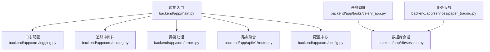
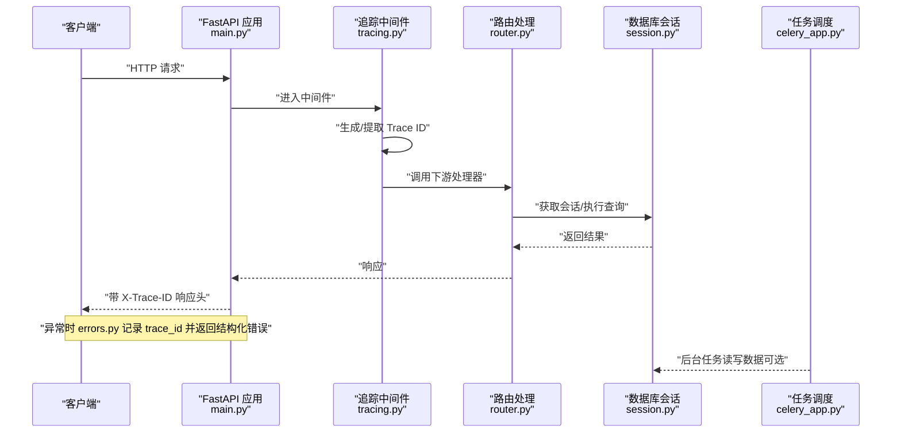
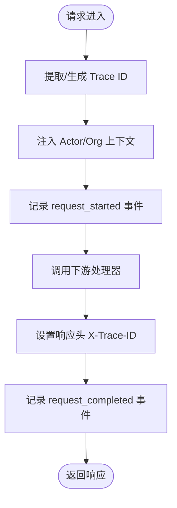
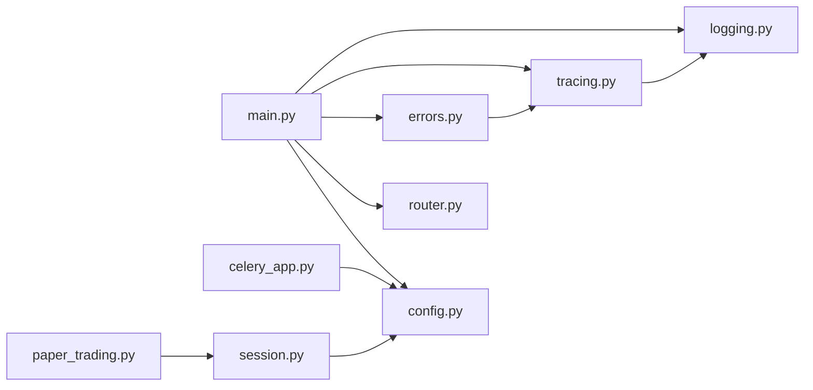

# 监控与可观测性

<cite>
**本文引用的文件**
- [backend/app/main.py](file://backend/app/main.py)
- [backend/app/core/logging.py](file://backend/app/core/logging.py)
- [backend/app/core/tracing.py](file://backend/app/core/tracing.py)
- [backend/app/core/config.py](file://backend/app/core/config.py)
- [backend/app/core/errors.py](file://backend/app/core/errors.py)
- [backend/app/tasks/celery_app.py](file://backend/app/tasks/celery_app.py)
- [backend/app/db/session.py](file://backend/app/db/session.py)
- [backend/app/api/v1/router.py](file://backend/app/api/v1/router.py)
- [backend/app/services/paper_trading.py](file://backend/app/services/paper_trading.py)
</cite>

## 目录
1. [简介](#简介)
2. [项目结构](#项目结构)
3. [核心组件](#核心组件)
4. [架构总览](#架构总览)
5. [详细组件分析](#详细组件分析)
6. [依赖分析](#依赖分析)
7. [性能考虑](#性能考虑)
8. [故障排查指南](#故障排查指南)
9. [结论](#结论)
10. [附录](#附录)

## 简介
本指南面向 llmine-quant 后端系统，围绕“监控与可观测性”目标，系统梳理并扩展现有能力，覆盖以下方面：
- 日志系统：结构化输出、级别控制、生产环境 JSON 渲染、开发环境控制台渲染
- 分布式追踪：Trace ID 生成与传播、请求级上下文注入、错误处理中的追踪关联
- 性能监控：应用生命周期事件、数据库连接与会话、任务队列与定时任务
- 告警与仪表盘：基于现有日志与追踪字段的告警规则建议与可视化布局思路
- 故障诊断：结合追踪 ID 的端到端定位流程

## 项目结构
后端采用 FastAPI 应用入口统一注册中间件、异常处理器与路由；核心可观测性能力集中在 logging、tracing、errors、config 等模块，并通过任务调度与数据库会话贯穿运行时。

**图表来源**
- [backend/app/main.py:1-65](file://backend/app/main.py#L1-L65)
- [backend/app/core/logging.py:1-41](file://backend/app/core/logging.py#L1-L41)
- [backend/app/core/tracing.py:1-87](file://backend/app/core/tracing.py#L1-L87)
- [backend/app/core/errors.py:1-119](file://backend/app/core/errors.py#L1-L119)
- [backend/app/api/v1/router.py:1-40](file://backend/app/api/v1/router.py#L1-L40)
- [backend/app/tasks/celery_app.py:1-42](file://backend/app/tasks/celery_app.py#L1-L42)
- [backend/app/db/session.py:1-34](file://backend/app/db/session.py#L1-L34)
- [backend/app/services/paper_trading.py:1-200](file://backend/app/services/paper_trading.py#L1-L200)

**章节来源**
- [backend/app/main.py:1-65](file://backend/app/main.py#L1-L65)
- [backend/app/core/logging.py:1-41](file://backend/app/core/logging.py#L1-L41)
- [backend/app/core/tracing.py:1-87](file://backend/app/core/tracing.py#L1-L87)
- [backend/app/core/errors.py:1-119](file://backend/app/core/errors.py#L1-L119)
- [backend/app/api/v1/router.py:1-40](file://backend/app/api/v1/router.py#L1-L40)
- [backend/app/tasks/celery_app.py:1-42](file://backend/app/tasks/celery_app.py#L1-L42)
- [backend/app/db/session.py:1-34](file://backend/app/db/session.py#L1-L34)
- [backend/app/services/paper_trading.py:1-200](file://backend/app/services/paper_trading.py#L1-L200)

## 核心组件
- 结构化日志：基于 structlog，按环境选择 JSON 或控制台渲染，支持时间戳、堆栈信息、异常格式化等处理器链
- 追踪中间件：在请求进入/退出时注入 Trace ID、Actor ID、组织 ID，并在日志中记录请求开始/结束事件
- 异常处理：捕获自定义异常与通用异常，统一记录 trace_id 并返回结构化响应
- 配置中心：集中管理日志级别、环境、数据库、Redis、CORS、LLM 提供商等关键参数
- 任务调度：Celery 应用与 Beat 定时任务，支持任务序列化、UTC 与时区、延迟确认等
- 数据库会话：异步引擎与会话工厂，支持 echo 开关与 SQLite 特殊连接参数

**章节来源**
- [backend/app/core/logging.py:11-41](file://backend/app/core/logging.py#L11-L41)
- [backend/app/core/tracing.py:49-87](file://backend/app/core/tracing.py#L49-L87)
- [backend/app/core/errors.py:73-119](file://backend/app/core/errors.py#L73-L119)
- [backend/app/core/config.py:48-108](file://backend/app/core/config.py#L48-L108)
- [backend/app/tasks/celery_app.py:15-42](file://backend/app/tasks/celery_app.py#L15-L42)
- [backend/app/db/session.py:10-21](file://backend/app/db/session.py#L10-L21)

## 架构总览
下图展示从客户端请求到业务处理、数据库访问与任务执行的可观测路径，以及日志与追踪如何贯穿全链路。

**图表来源**
- [backend/app/main.py:39-65](file://backend/app/main.py#L39-L65)
- [backend/app/core/tracing.py:49-87](file://backend/app/core/tracing.py#L49-L87)
- [backend/app/api/v1/router.py:23-40](file://backend/app/api/v1/router.py#L23-L40)
- [backend/app/db/session.py:24-34](file://backend/app/db/session.py#L24-L34)
- [backend/app/tasks/celery_app.py:15-42](file://backend/app/tasks/celery_app.py#L15-L42)
- [backend/app/core/errors.py:73-119](file://backend/app/core/errors.py#L73-L119)

## 详细组件分析

### 日志系统
- 配置入口：在应用启动时调用日志配置函数，设置基础格式与级别
- structlog 处理器链：
  - 合并上下文变量
  - 添加日志级别
  - 时间戳 ISO 格式
  - 堆栈信息渲染
  - 异常信息格式化
  - Unicode 解码
  - JSON 渲染（生产）或控制台渲染（开发）
- 级别与环境：由配置项决定默认级别与渲染方式
- 使用方式：通过结构化日志器记录结构化事件，便于后续检索与聚合

建议增强：
- 文件轮转：在生产环境使用 RotatingFileHandler 或 WatchedFileHandler，并结合 JSONRenderer 输出到文件
- 集中式收集：将 JSON 输出重定向至 stdout/stderr，由容器日志驱动（如 Fluent Bit/Fluentd/OpenTelemetry Collector）采集
- 字段规范：统一事件键（如 trace_id、actor_id、org_id、level、timestamp、module、event、msg），确保跨服务一致

**章节来源**
- [backend/app/core/logging.py:11-41](file://backend/app/core/logging.py#L11-L41)
- [backend/app/core/config.py:52-56](file://backend/app/core/config.py#L52-L56)

### 分布式追踪
- Trace ID：首次请求生成 TRACE- 前缀的 UUID 缩写，后续复用请求头中的 X-Trace-ID
- 上下文变量：通过 contextvars 维护 trace_id、actor_id、org_id，便于在整个请求生命周期内传递
- 中间件行为：在请求开始与结束分别记录 debug 级别的事件，包含方法、路径、状态码等
- 错误关联：异常处理器从上下文读取 trace_id，保证错误与追踪的一致性

建议增强：
- Span 上下文：在业务层（如数据库事务、外部服务调用）创建子 Span，携带父 Span 上下文
- 采样策略：根据业务流量与成本设定采样率，避免高基数追踪开销
- 跨进程传播：在 HTTP 外部调用中透传 X-Trace-ID 与自定义追踪头，保持链路连续

**图表来源**
- [backend/app/core/tracing.py:49-87](file://backend/app/core/tracing.py#L49-L87)

**章节来源**
- [backend/app/core/tracing.py:13-47](file://backend/app/core/tracing.py#L13-L47)
- [backend/app/core/tracing.py:49-87](file://backend/app/core/tracing.py#L49-L87)
- [backend/app/core/errors.py:77-86](file://backend/app/core/errors.py#L77-L86)

### 异常处理与可观测性
- 自定义异常：统一包装业务异常，包含 code、status_code、details
- 错误记录：捕获 LLMineException 与通用异常，记录 trace_id、路径、方法、错误详情
- 响应格式：返回结构化 JSON，包含 trace_id，便于前端与运维定位

建议增强：
- 指标埋点：对不同异常类型计数，形成告警基线
- 采样上报：对高频异常进行采样上报，避免日志风暴

**章节来源**
- [backend/app/core/errors.py:13-71](file://backend/app/core/errors.py#L13-L71)
- [backend/app/core/errors.py:73-119](file://backend/app/core/errors.py#L73-L119)

### 配置与运行时
- 环境与日志：env、log_level 控制日志渲染与级别
- 数据库：database_url、database_echo 控制连接与 SQL 回显
- Redis：用于 Celery 任务队列与结果存储
- CORS：允许跨域请求
- LLM 提供商：自动检测与优先级策略，影响日志与健康检查输出

**章节来源**
- [backend/app/core/config.py:48-108](file://backend/app/core/config.py#L48-L108)
- [backend/app/main.py:20-36](file://backend/app/main.py#L20-L36)

### 任务调度与性能
- Celery 应用：序列化、时区、延迟确认、每工人最大任务数等配置
- Beat 定时：每日 EOD 任务，适合与业务日终结算联动
- 数据库交互：Paper Trading 引擎涉及多阶段操作（标记、信号、预检查、撮合、净值），建议在关键步骤打点

**章节来源**
- [backend/app/tasks/celery_app.py:15-42](file://backend/app/tasks/celery_app.py#L15-L42)
- [backend/app/services/paper_trading.py:76-135](file://backend/app/services/paper_trading.py#L76-L135)

### 数据库会话
- 异步引擎：支持 echo 开关与 SQLite 特殊连接参数
- 会话依赖：提供 get_db 依赖，异常时回滚并关闭会话

**章节来源**
- [backend/app/db/session.py:10-34](file://backend/app/db/session.py#L10-L34)

## 依赖分析
- 应用入口依赖：logging、tracing、errors、router、config
- 追踪依赖：contextvars、FastAPI Request、structlog 日志器
- 任务依赖：Celery、crontab、Redis
- 数据库依赖：SQLAlchemy AsyncEngine、AsyncSession

**图表来源**
- [backend/app/main.py:1-65](file://backend/app/main.py#L1-L65)
- [backend/app/core/logging.py:1-41](file://backend/app/core/logging.py#L1-L41)
- [backend/app/core/tracing.py:1-87](file://backend/app/core/tracing.py#L1-L87)
- [backend/app/core/errors.py:1-119](file://backend/app/core/errors.py#L1-L119)
- [backend/app/api/v1/router.py:1-40](file://backend/app/api/v1/router.py#L1-L40)
- [backend/app/core/config.py:1-196](file://backend/app/core/config.py#L1-L196)
- [backend/app/tasks/celery_app.py:1-42](file://backend/app/tasks/celery_app.py#L1-L42)
- [backend/app/db/session.py:1-34](file://backend/app/db/session.py#L1-L34)
- [backend/app/services/paper_trading.py:1-200](file://backend/app/services/paper_trading.py#L1-L200)

**章节来源**
- [backend/app/main.py:1-65](file://backend/app/main.py#L1-L65)
- [backend/app/core/tracing.py:1-87](file://backend/app/core/tracing.py#L1-L87)
- [backend/app/core/errors.py:1-119](file://backend/app/core/errors.py#L1-L119)
- [backend/app/tasks/celery_app.py:1-42](file://backend/app/tasks/celery_app.py#L1-L42)
- [backend/app/db/session.py:1-34](file://backend/app/db/session.py#L1-L34)
- [backend/app/services/paper_trading.py:1-200](file://backend/app/services/paper_trading.py#L1-L200)

## 性能考虑
- 应用性能
  - 生命周期事件：在 lifespan 中记录启动与关闭事件，便于评估冷启动与停机时间
  - CORS 与中间件：仅保留必要中间件，减少请求路径开销
- 数据库性能
  - echo 开关：开发调试时开启，生产关闭以避免 SQL 日志噪声
  - SQLite 连接参数：非主线程校验在某些场景下可降低锁竞争
- 外部服务调用
  - LLM 提供商：超时与令牌限制在配置中集中管理，避免单点过载
  - 任务队列：延迟确认与每工人最大任务数有助于稳定吞吐与内存占用

**章节来源**
- [backend/app/main.py:20-36](file://backend/app/main.py#L20-L36)
- [backend/app/core/config.py:58-99](file://backend/app/core/config.py#L58-L99)
- [backend/app/db/session.py:10-21](file://backend/app/db/session.py#L10-L21)
- [backend/app/tasks/celery_app.py:22-31](file://backend/app/tasks/celery_app.py#L22-L31)

## 故障排查指南
- 快速定位
  - 使用响应头中的 X-Trace-ID 在日志系统中检索整条链路
  - 在错误响应体中核对 trace_id，确保前后端一致
- 常见问题
  - 未设置 X-Trace-ID：追踪中间件会自动生成，但建议客户端始终透传
  - 异常未记录 trace_id：检查异常处理器是否正确注入
  - 日志格式不一致：确认环境变量与渲染器配置
- 诊断步骤
  - 重现请求并记录 X-Trace-ID
  - 在日志系统中按 trace_id 过滤，查看 request_started/request_completed 与业务关键步骤
  - 对照异常处理器日志，定位具体错误位置与原因

**章节来源**
- [backend/app/core/tracing.py:56-84](file://backend/app/core/tracing.py#L56-L84)
- [backend/app/core/errors.py:77-95](file://backend/app/core/errors.py#L77-L95)

## 结论
当前系统已具备结构化日志与请求级追踪的基础能力。建议在此基础上完善：
- 日志文件轮转与集中式采集
- 跨服务追踪头透传与采样策略
- 关键业务步骤的指标打点与告警规则
- 基于 trace_id 的端到端诊断流程与仪表盘

## 附录

### 建议的告警规则（基于现有字段）
- 高频错误：按 trace_id 聚合错误数量，超过阈值触发
- 延迟异常：request_completed 中 status_code 正常但耗时异常
- 未捕获异常：出现 unhandled_exception 事件
- LLM 调用失败：特定 Provider 的错误计数上升
- 数据库慢查询：基于 echo 与外部监控工具识别慢事务

### 监控仪表板设计思路
- 请求概览：QPS、P95/P99 延迟、错误率、成功率
- 追踪视图：按 trace_id 的链路拓扑，标注关键步骤耗时
- 异常面板：按 code/trace_id/路径/方法分类统计
- 任务队列：任务积压、失败率、执行时延
- 数据库：连接数、事务耗时、慢查询