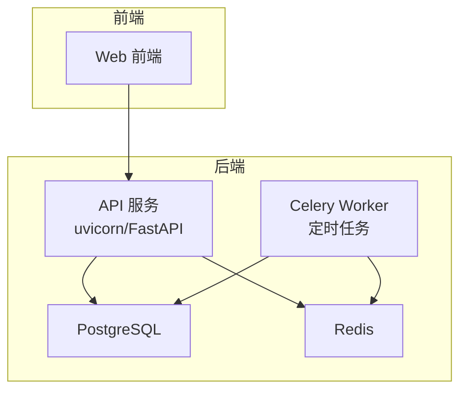
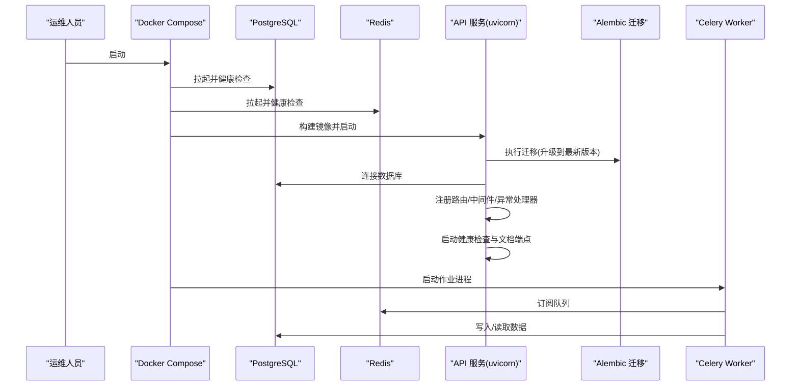
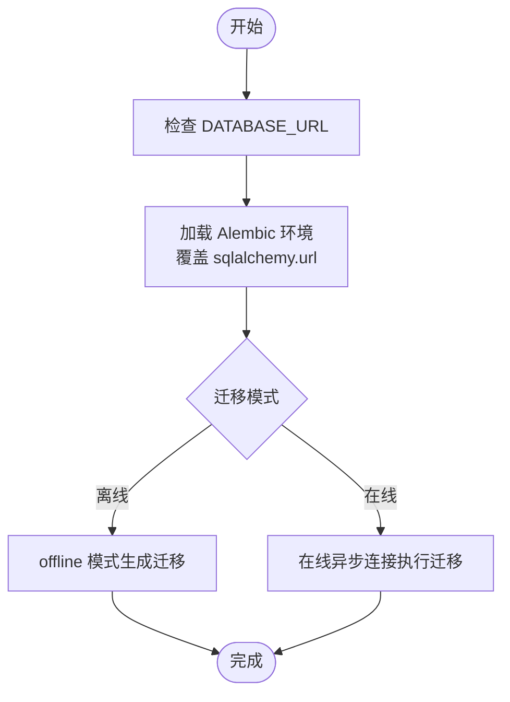
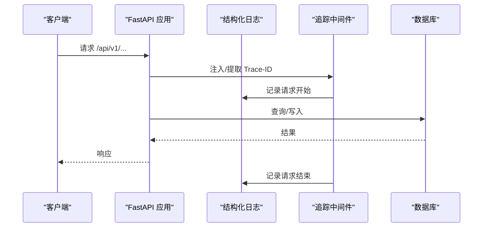
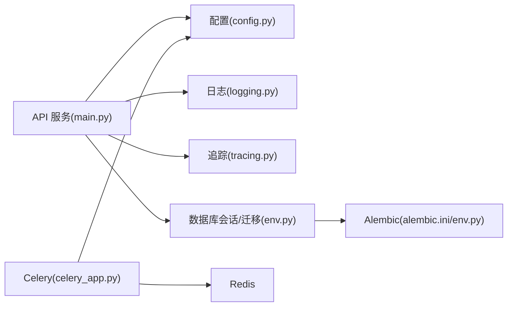

# 部署与运维

<cite>
**本文引用的文件**
- [docker-compose.yml](file://deploy/docker-compose.yml)
- [Dockerfile](file://backend/Dockerfile)
- [pyproject.toml](file://backend/pyproject.toml)
- [alembic.ini](file://backend/alembic.ini)
- [README.md（后端）](file://backend/README.md)
- [seed_dev_data.py](file://backend/scripts/seed_dev_data.py)
- [import_market_data.py](file://backend/scripts/import_market_data.py)
- [main.py](file://backend/app/main.py)
- [config.py](file://backend/app/core/config.py)
- [logging.py](file://backend/app/core/logging.py)
- [tracing.py](file://backend/app/core/tracing.py)
- [celery_app.py](file://backend/app/tasks/celery_app.py)
- [env.py（迁移）](file://backend/app/db/migrations/env.py)
</cite>

## 目录
1. [简介](#简介)
2. [项目结构](#项目结构)
3. [核心组件](#核心组件)
4. [架构总览](#架构总览)
5. [详细组件分析](#详细组件分析)
6. [依赖关系分析](#依赖关系分析)
7. [性能考虑](#性能考虑)
8. [故障排除指南](#故障排除指南)
9. [结论](#结论)
10. [附录](#附录)

## 简介
本指南面向 llmine-quant 的部署与运维团队，覆盖容器化部署、环境配置、服务编排、数据库迁移与初始化脚本、安全配置、性能调优、日志与分布式追踪、监控告警、故障排除、备份恢复与升级维护等主题。文档以仓库中的实际文件为依据，提供可操作的步骤与最佳实践。

## 项目结构
- 后端采用 FastAPI + SQLAlchemy 异步 ORM + Alembic 迁移，提供 REST API 与 WebSocket 路由，并通过 Celery 执行定时任务。
- 前端为独立的 TypeScript/Vite 工程，后端提供 API 文档与健康检查端点。
- 部署层使用 Docker Compose 将 API、PostgreSQL、Redis 组织为完整栈；Dockerfile 定义镜像构建流程；pyproject.toml 管理依赖与工具链；alembic.ini 配置迁移日志与脚手架参数。

图表来源
- [docker-compose.yml:34-54](file://deploy/docker-compose.yml#L34-L54)
- [main.py:39-64](file://backend/app/main.py#L39-L64)
- [celery_app.py:15-41](file://backend/app/tasks/celery_app.py#L15-L41)

章节来源
- [docker-compose.yml:1-59](file://deploy/docker-compose.yml#L1-59)
- [Dockerfile:1-25](file://backend/Dockerfile#L1-25)
- [pyproject.toml:1-78](file://backend/pyproject.toml#L1-78)
- [alembic.ini:1-111](file://backend/alembic.ini#L1-111)
- [README.md（后端）:1-45](file://backend/README.md#L1-45)

## 核心组件
- 容器编排：使用 Docker Compose 在本地快速搭建 API、PostgreSQL、Redis 三件套，含健康检查与卷挂载。
- 镜像构建：基于 Python slim 镜像，安装系统依赖，复制并安装项目依赖与应用代码，暴露 8000 端口，启动时自动执行数据库迁移。
- 数据库迁移：Alembic 环境读取配置中的数据库 URL，支持离线/在线迁移；迁移脚本位于 app/db/migrations。
- 初始化脚本：开发数据种子脚本用于快速填充用户、角色、熔断与风控预算等基础数据。
- 任务调度：Celery 使用 Redis 作为 Broker/Backend，定义每日盘后任务计划。
- 日志与追踪：结构化日志按环境输出 JSON 或控制台；请求级追踪中间件注入 Trace-ID 并在日志中记录请求生命周期。
- 配置管理：Pydantic Settings 加载 .env，支持从用户主目录自动加载 LLM 凭证，支持 SQLite URL 规范化。

章节来源
- [docker-compose.yml:34-54](file://deploy/docker-compose.yml#L34-L54)
- [Dockerfile:15-24](file://backend/Dockerfile#L15-L24)
- [env.py（迁移）:55-59](file://backend/app/db/migrations/env.py#L55-L59)
- [seed_dev_data.py:12-22](file://backend/scripts/seed_dev_data.py#L12-L22)
- [celery_app.py:35-41](file://backend/app/tasks/celery_app.py#L35-L41)
- [logging.py:11-35](file://backend/app/core/logging.py#L11-L35)
- [tracing.py:49-86](file://backend/app/core/tracing.py#L49-L86)
- [config.py:48-108](file://backend/app/core/config.py#L48-L108)

## 架构总览
下图展示容器编排、应用启动流程与数据流：

图表来源
- [docker-compose.yml:34-54](file://deploy/docker-compose.yml#L34-L54)
- [Dockerfile:23-24](file://backend/Dockerfile#L23-L24)
- [env.py（迁移）:104-112](file://backend/app/db/migrations/env.py#L104-L112)
- [main.py:39-64](file://backend/app/main.py#L39-L64)
- [celery_app.py:15-41](file://backend/app/tasks/celery_app.py#L15-L41)

## 详细组件分析

### 容器化部署与编排
- 服务组成
  - postgres：PostgreSQL 16，持久化卷，健康检查基于 pg_isready。
  - redis：Redis 7，持久化卷，健康检查基于 redis-cli ping。
  - api：基于 backend/Dockerfile 构建，设置 DATABASE_URL、REDIS_URL、SECRET_KEY、ENV、LOG_LEVEL 等环境变量，依赖 postgres 与 redis 健康后启动，挂载后端源码以便热更新调试。
- 命令流程
  - 启动顺序：先执行 alembic 升级到最新版本，再启动 uvicorn。
  - 端口映射：PostgreSQL 5432 → 主机 5432；Redis 6379 → 主机 6379；API 8000 → 主机 8000。
- 生产建议
  - 使用只读挂载生产镜像而非源码；为敏感变量启用外部密钥管理；为卷配置备份策略；限制容器资源与网络访问。

章节来源
- [docker-compose.yml:1-59](file://deploy/docker-compose.yml#L1-59)
- [Dockerfile:34-54](file://backend/Dockerfile#L34-L54)

### 镜像构建流程
- 基础镜像：python:3.11-slim
- 系统依赖：gcc、libpq-dev（PostgreSQL C 扩展）
- 依赖安装：pip 安装项目自身（可编辑模式），满足 FastAPI、SQLAlchemy、Alembic、Celery、Redis 等依赖
- 复制内容：app/、alembic.ini、scripts/
- 入口命令：先执行 alembic 升级，再 uvicorn 启动服务

章节来源
- [Dockerfile:1-25](file://backend/Dockerfile#L1-25)
- [pyproject.toml:7-27](file://backend/pyproject.toml#L7-27)

### 数据库迁移与初始化
- 迁移入口
  - alembic.ini 指定迁移脚本目录与日志级别
  - env.py 读取 settings.database_url，覆盖默认 sqlalchemy.url，支持异步迁移
- 初始化脚本
  - seed_dev_data.py：创建表并填充组织、用户、角色、用户角色、熔断器、风控预算等开发数据
  - import_market_data.py：支持从 CSV 或 AKShare 导入日线行情数据

图表来源
- [alembic.ini](file://backend/alembic.ini#L58)
- [env.py（迁移）:55-59](file://backend/app/db/migrations/env.py#L55-L59)
- [env.py（迁移）:87-101](file://backend/app/db/migrations/env.py#L87-L101)

章节来源
- [alembic.ini:1-111](file://backend/alembic.ini#L1-111)
- [env.py（迁移）:1-113](file://backend/app/db/migrations/env.py#L1-113)
- [seed_dev_data.py:12-22](file://backend/scripts/seed_dev_data.py#L12-L22)
- [import_market_data.py:14-31](file://backend/scripts/import_market_data.py#L14-L31)

### API 服务与中间件
- 应用生命周期：启动时打印关键配置信息，启动行情流；关闭时停止行情流并记录 shutdown
- 中间件：CORS、结构化日志、分布式追踪中间件
- 异常处理：统一异常处理器
- 路由：REST API 前缀 /api/v1；WebSocket 路由 /ws
- 健康检查：/health 返回版本号

图表来源
- [main.py:20-36](file://backend/app/main.py#L20-L36)
- [main.py:49-58](file://backend/app/main.py#L49-L58)
- [tracing.py:49-86](file://backend/app/core/tracing.py#L49-L86)
- [logging.py:19-35](file://backend/app/core/logging.py#L19-L35)

章节来源
- [main.py:1-65](file://backend/app/main.py#L1-L65)
- [tracing.py:1-87](file://backend/app/core/tracing.py#L1-87)
- [logging.py:1-41](file://backend/app/core/logging.py#L1-41)

### 配置管理与安全
- 配置来源：.env 文件，支持从用户主目录自动加载 Claude/Codex 凭证，优先级高于 .env
- 关键配置项：DATABASE_URL、REDIS_URL、SECRET_KEY、ENV、LOG_LEVEL、CORS、API 前缀、分页、市场数据与 LLM 提供商
- 安全建议：生产环境必须设置强 SECRET_KEY；限制 CORS；启用 HTTPS；对敏感环境变量进行加密存储与轮换

章节来源
- [config.py:48-108](file://backend/app/core/config.py#L48-L108)
- [config.py:110-172](file://backend/app/core/config.py#L110-L172)
- [README.md（后端）:32-41](file://backend/README.md#L32-L41)

### 任务调度与队列
- Broker/Backend：Redis（默认 redis://redis:6379/0）
- 任务：每日盘后（工作日 15:30）执行纸交易 EOD 流程
- 参数：序列化、UTC 与时区、任务重试与最大任务数等

章节来源
- [celery_app.py:11-41](file://backend/app/tasks/celery_app.py#L11-L41)

### 日志与分布式追踪
- 日志：结构化输出，生产环境输出 JSON，开发环境输出控制台；日志级别由 ENV 控制
- 追踪：中间件注入 X-Trace-ID，记录请求开始/结束与状态码；可扩展从 JWT 提取 Actor/Org 上下文

章节来源
- [logging.py:11-35](file://backend/app/core/logging.py#L11-L35)
- [tracing.py:49-86](file://backend/app/core/tracing.py#L49-L86)

## 依赖关系分析
- 组件耦合
  - API 依赖配置模块、日志模块、追踪中间件、数据库会话与迁移环境
  - Celery 依赖配置模块与 Redis
  - 迁移环境依赖配置模块与所有领域模型
- 外部依赖
  - PostgreSQL/Redis 作为基础设施；Alembic/SQLAlchemy 用于迁移与 ORM；Celery/Redis 用于任务队列

图表来源
- [main.py:8-14](file://backend/app/main.py#L8-L14)
- [config.py:48-108](file://backend/app/core/config.py#L48-L108)
- [logging.py:11-35](file://backend/app/core/logging.py#L11-L35)
- [tracing.py:49-86](file://backend/app/core/tracing.py#L49-L86)
- [celery_app.py:15-20](file://backend/app/tasks/celery_app.py#L15-L20)
- [env.py（迁移）:11-44](file://backend/app/db/migrations/env.py#L11-L44)
- [alembic.ini:1-111](file://backend/alembic.ini#L1-111)

章节来源
- [main.py:1-65](file://backend/app/main.py#L1-L65)
- [celery_app.py:1-42](file://backend/app/tasks/celery_app.py#L1-42)
- [env.py（迁移）:1-113](file://backend/app/db/migrations/env.py#L1-113)

## 性能考虑
- 数据库
  - 使用异步 SQLAlchemy；合理设置连接池与超时；避免 N+1 查询；索引与分区策略按业务增长评估
- API
  - 合理分页与查询过滤；缓存热点数据；压缩响应；限流与熔断
- 任务队列
  - 任务幂等性；任务拆分与并行度；worker 数量与重启策略；队列优先级
- 日志
  - 生产环境使用 JSON 输出，便于日志收集与检索；避免高频 debug 语句
- 追踪
  - Trace-ID 传播到下游服务；采样策略与存储周期

## 故障排除指南
- 启动失败（数据库未就绪）
  - 现象：API 启动时报连接错误
  - 排查：确认 postgres 服务健康；检查 DATABASE_URL；等待 postgres 健康检查通过后再启动 API
- 迁移失败
  - 现象：启动时报迁移错误
  - 排查：查看 Alembic 日志；确认 alembic.ini 中 sqlalchemy.url 与 settings 一致；检查数据库权限
- Redis 连接问题
  - 现象：任务无法投递或 worker 报错
  - 排查：确认 redis 健康；检查 REDIS_URL；确认网络连通
- 权限与 CORS
  - 现象：跨域或鉴权失败
  - 排查：核对 CORS 配置；确认 SECRET_KEY；检查前端代理与证书
- 日志与追踪
  - 现象：日志格式不符合预期或缺少 Trace-ID
  - 排查：检查 ENV 与 LOG_LEVEL；确认追踪中间件注册；确保请求头携带 X-Trace-ID

章节来源
- [docker-compose.yml:15-19](file://deploy/docker-compose.yml#L15-L19)
- [docker-compose.yml:28-32](file://deploy/docker-compose.yml#L28-L32)
- [env.py（迁移）:55-59](file://backend/app/db/migrations/env.py#L55-L59)
- [alembic.ini:77-111](file://backend/alembic.ini#L77-L111)
- [celery_app.py:11-12](file://backend/app/tasks/celery_app.py#L11-L12)
- [config.py:69-70](file://backend/app/core/config.py#L69-L70)
- [logging.py:27-35](file://backend/app/core/logging.py#L27-L35)
- [tracing.py:55-76](file://backend/app/core/tracing.py#L55-L76)

## 结论
通过 Docker Compose 快速搭建后端三件套，结合 Alembic 迁移与初始化脚本，可在本地与生产环境实现一致的部署体验。配合结构化日志、请求追踪、任务队列与合理的安全配置，系统具备良好的可观测性与可维护性。建议在生产环境中进一步完善密钥管理、网络隔离、资源配额与备份策略。

## 附录

### 环境变量清单（后端）
- DATABASE_URL：数据库连接串（默认指向本地 PostgreSQL）
- REDIS_URL：Redis 连接串（默认指向本地 Redis）
- SECRET_KEY：JWT 签名密钥（生产必须替换）
- ENV：环境标识（development/staging/production）
- LOG_LEVEL：日志级别（INFO/WARN/ERROR 等）

章节来源
- [README.md（后端）:32-41](file://backend/README.md#L32-L41)
- [config.py:52-55](file://backend/app/core/config.py#L52-L55)
- [config.py:61-62](file://backend/app/core/config.py#L61-L62)
- [config.py:65-67](file://backend/app/core/config.py#L65-L67)

### 健康检查与端点
- /health：返回应用状态与版本
- /docs：OpenAPI 文档
- /redoc：ReDoc 文档

章节来源
- [main.py:41-44](file://backend/app/main.py#L41-L44)
- [main.py:61-64](file://backend/app/main.py#L61-L64)

### 开发数据与市场数据导入
- 开发数据：执行 seed_dev_data.py 完成表创建与初始数据填充
- 市场数据：支持 CSV 与 AKShare 两种导入方式，可指定日期范围与复权因子

章节来源
- [seed_dev_data.py:12-22](file://backend/scripts/seed_dev_data.py#L12-L22)
- [import_market_data.py:14-31](file://backend/scripts/import_market_data.py#L14-L31)