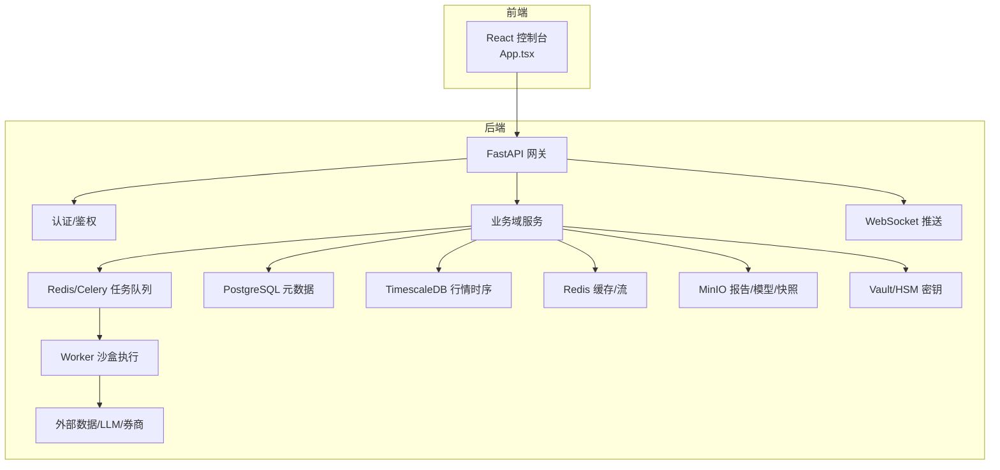
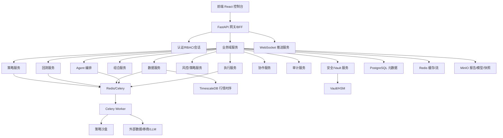
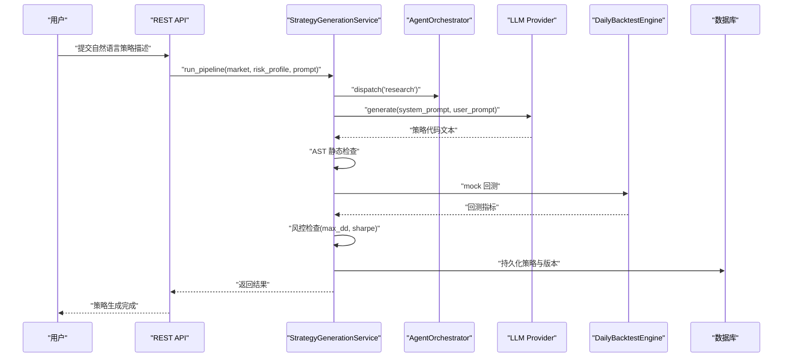
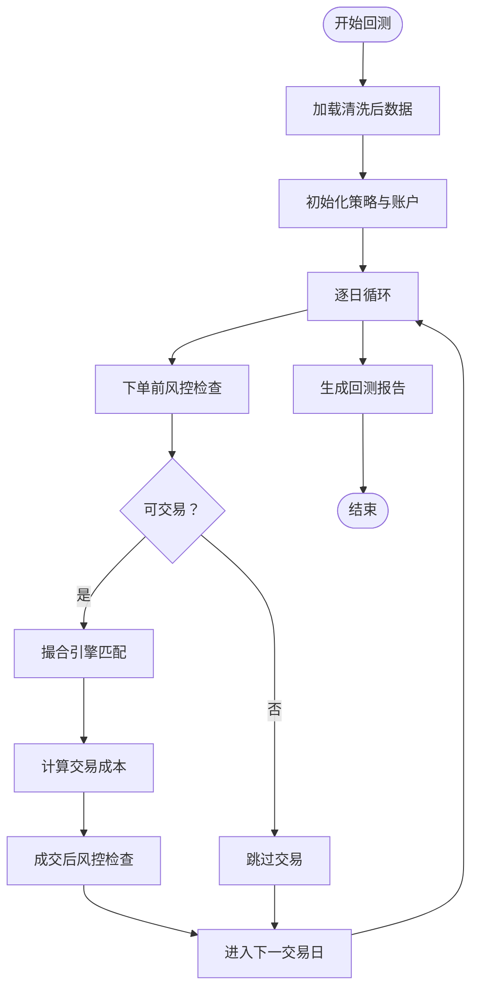
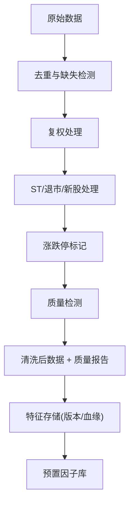
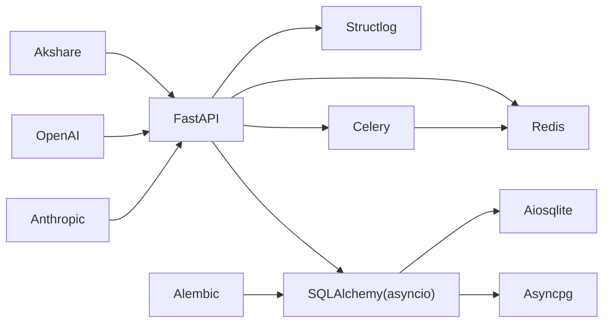

# 项目概述

<cite>
**本文引用的文件**
- [backend/README.md](file://backend/README.md)
- [backend/app/main.py](file://backend/app/main.py)
- [backend/app/api/v1/router.py](file://backend/app/api/v1/router.py)
- [backend/pyproject.toml](file://backend/pyproject.toml)
- [doc/01-产品概述与愿景.md](file://doc/01-产品概述与愿景.md)
- [doc/03-核心模块设计.md](file://doc/03-核心模块设计.md)
- [doc/05-实施路线图.md](file://doc/05-实施路线图.md)
- [doc/07-后端项目设计说明书.md](file://doc/07-后端项目设计说明书.md)
- [doc/系统核心介绍/03-模型配置与Agent构建逻辑.md](file://doc/系统核心介绍/03-模型配置与Agent构建逻辑.md)
- [frontend/src/App.tsx](file://frontend/src/App.tsx)
</cite>

## 目录
1. [引言](#引言)
2. [项目结构](#项目结构)
3. [核心组件](#核心组件)
4. [架构总览](#架构总览)
5. [详细组件分析](#详细组件分析)
6. [依赖关系分析](#依赖关系分析)
7. [性能考量](#性能考量)
8. [故障排查指南](#故障排查指南)
9. [结论](#结论)
10. [附录](#附录)

## 引言
LLMine Quant 是一款面向中国 A 股市场的 AI 原生量化投研与交易系统。其核心价值在于通过 AI Agent 协作，将自然语言策略描述自动转化为可执行策略，并贯穿“数据→研究→策略→回测→模拟交易→实盘交易”的完整闭环。系统强调安全、可解释、数据严谨与风控闭环，目标是让具备投资想法的任何人，都能在严格风控与可追溯的前提下，快速验证策略、管理组合并执行交易。

与传统量化平台相比，LLMine Quant 的差异化优势体现在：
- 策略研发：自然语言 + Agent 协作，大幅降低研发门槛
- 回测质量：内置偏见检测与滚动验证，显著减少过拟合风险
- 信号解释：可解释归因与数据血缘追踪，提升透明度
- 风控：AI 风控 Agent 动态评估与熔断机制
- 协作：多人分权与 AI Agent 协作评审

## 项目结构
后端采用模块化单体架构，前端为 React 控制台，整体围绕“策略工厂”“回测实验室”“解释与血缘”“组合驾驶舱”“交易审批”“风控与熔断”“行情与合规”“资金安全”“协作实验室”“审计追踪”“模拟盘”等 11 个业务屏提供 API 与可视化。

图表来源
- [doc/07-后端项目设计说明书.md:41-77](file://doc/07-后端项目设计说明书.md#L41-L77)
- [frontend/src/App.tsx:1-299](file://frontend/src/App.tsx#L1-L299)

章节来源
- [backend/app/api/v1/router.py:1-40](file://backend/app/api/v1/router.py#L1-L40)
- [doc/07-后端项目设计说明书.md:1-236](file://doc/07-后端项目设计说明书.md#L1-L236)

## 核心组件
- AI 模型与 Agent 体系：统一的 LLM Provider 抽象（Anthropic/OpenAI/Mock），配合 AgentOrchestrator 实现多 Agent 角色协作（研究/策略/回测/风控/执行/组合/解释/数据）。
- 策略生成流水线：从自然语言到策略代码再到回测与风控检查的 6 步流水线，确保策略可执行、可验证、可追溯。
- 回测引擎：支持 A 股规则（T+1、涨跌停、停牌、ST、复权、手续费、印花税）的撮合与成本模型，提供多维度回测报告与过拟合检测。
- 风控引擎：三层风控（账户/组合/策略）与熔断机制，结合实时监控与压力测试。
- 组合引擎：均值方差、风险平价、Black-Litterman 等优化器与再平衡策略。
- 可解释性引擎：规则/ML/组合信号的归因与特征血缘追踪。
- 审批与审计：策略/订单/风控变更的审批流与不可篡改审计日志。
- 数据引擎：多数据源适配器（AKShare/Tushare 等）与 A 股数据清洗管道，特征存储与版本管理。

章节来源
- [doc/系统核心介绍/03-模型配置与Agent构建逻辑.md:33-492](file://doc/系统核心介绍/03-模型配置与Agent构建逻辑.md#L33-L492)
- [doc/03-核心模块设计.md:1-599](file://doc/03-核心模块设计.md#L1-L599)

## 架构总览
系统采用“模块化单体 + 异步任务 + 事件总线”的架构，核心原则包括：
- 模块化单体优先：一个 FastAPI 应用，按业务域拆分模块
- 同步 API + 异步任务：查询与轻操作走 REST，长任务走 Celery，状态通过事件与 WebSocket 推送
- 事件驱动审计：关键状态变化先落业务表，再写 Outbox，异步分发并写审计
- 策略代码沙盒：AI 生成代码与用户策略在隔离 worker 执行
- 风控前置：任何订单、模拟盘部署、实盘候选上线前必须调用 Policy/Risk
- 数据许可强约束：数据源许可范围贯穿策略、回测、信号、订单全链路
- 幂等优先：任务创建、审批、下单、回报处理都支持幂等键

图表来源
- [doc/07-后端项目设计说明书.md:41-77](file://doc/07-后端项目设计说明书.md#L41-L77)

章节来源
- [doc/07-后端项目设计说明书.md:11-39](file://doc/07-后端项目设计说明书.md#L11-L39)

## 详细组件分析

### AI Agent 与策略生成流水线
- 模型配置与 Provider 抽象：统一 Settings 配置，支持 Anthropic、OpenAI、Mock 三类 Provider；工厂函数按配置动态选择。
- Agent 角色：研究、策略、回测、风控、执行、组合、解释、数据等角色协同工作。
- 策略生成 6 步流水线：研究 → 代码生成 → 静态检查 → 回测 → 风控检查 → 持久化。
- Prompt 模板：两套模板分别生成策略代码与元数据，温度设为低随机性以保证稳定输出。
- 调用链路：配置注入 → Provider 选择 → Prompt 模板 → Agent 协作 → 回测与风控 → 持久化。

图表来源
- [doc/系统核心介绍/03-模型配置与Agent构建逻辑.md:368-437](file://doc/系统核心介绍/03-模型配置与Agent构建逻辑.md#L368-L437)
- [backend/app/services/strategy_generation.py:86-289](file://backend/app/services/strategy_generation.py#L86-L289)

章节来源
- [doc/系统核心介绍/03-模型配置与Agent构建逻辑.md:33-492](file://doc/系统核心介绍/03-模型配置与Agent构建逻辑.md#L33-L492)
- [backend/app/services/strategy_generation.py:1-289](file://backend/app/services/strategy_generation.py#L1-L289)

### 回测引擎与风控
- 回测配置：包含 A 股交易规则（佣金、印花税、过户费、滑点、T+1、涨跌停、停牌、ST 等）与风控参数。
- A 股撮合逻辑：处理 T+1、涨跌停、停牌、ST 等特殊规则，计算交易成本。
- 过拟合检测：样本内外一致性、参数稳定性、滑点鲁棒性、夏普比率衰减等多维度过拟合评估。
- 风控三层体系：账户级、组合级、策略级；熔断规则覆盖可恢复/不可恢复/组合/全市场等场景。
- 风控 API：下单前检查、成交后检查、实时监控、压力测试。

图表来源
- [doc/03-核心模块设计.md:225-363](file://doc/03-核心模块设计.md#L225-L363)

章节来源
- [doc/03-核心模块设计.md:225-425](file://doc/03-核心模块设计.md#L225-L425)

### 数据引擎与特征存储
- 数据源适配器：支持 AKShare、Tushare、Baostock、Wind 等多数据源，覆盖 A 股行情、财务、宏观数据。
- A 股数据清洗：去重与缺失检测、复权处理、ST/退市/新股处理、涨跌停标记、质量检测。
- 特征存储：版本管理与血缘追踪，支持特征向量与矩阵查询，验证无未来函数。
- 预置因子库：价量、动量、波动、价值、质量、情绪、宏观等类别因子。

图表来源
- [doc/03-核心模块设计.md:3-134](file://doc/03-核心模块设计.md#L3-L134)

章节来源
- [doc/03-核心模块设计.md:3-134](file://doc/03-核心模块设计.md#L3-L134)

### 组合引擎与可解释性引擎
- 组合优化器：均值方差、风险平价、Black-Litterman、最大分散化等。
- 再平衡策略：定期再平衡、阈值再平衡、事件再平衡、风险再平衡。
- 可解释性引擎：规则/ML/组合信号的归因分析，特征重要性与局部解释，血缘追踪。

章节来源
- [doc/03-核心模块设计.md:426-599](file://doc/03-核心模块设计.md#L426-L599)

### 审批与审计
- 审批流：AI 生成订单草案 → 自动风控检查 → 人工审批（实盘/超限额）→ 执行/拒绝。
- 审计日志：记录时间戳、执行者、动作、资源、结果、置信度、追踪 ID、来源 IP、签名等。

章节来源
- [doc/03-核心模块设计.md:529-569](file://doc/03-核心模块设计.md#L529-L569)

### 前端与用户体验
- 前端采用 React 控制台，提供 Dashboard、Strategy、Backtest、Explain、Portfolio、Execution、Risk、Data、Security、Collaboration、Audit、Paper 等 11 个业务屏。
- 支持命令面板、Kill Switch、全局概览、系统健康状态等。
- WebSocket 连接用于策略、执行、风控等实时数据推送。

章节来源
- [frontend/src/App.tsx:1-299](file://frontend/src/App.tsx#L1-L299)

## 依赖关系分析
后端技术栈与依赖：
- Web 框架与服务：FastAPI、Uvicorn、WebSockets
- ORM 与数据库：SQLAlchemy(asyncio)、Asyncpg、Aiosqlite、Alembic
- 配置与安全：Pydantic Settings、JWKS、Passlib、bcrypt
- 日志与可观测性：Structlog、Prometheus
- 异步任务：Celery、Redis
- LLM 与市场数据：Anthropic、OpenAI、Akshare
- 类型检查与格式化：Ruff、MyPy、基于 Pyright 的 VSCode 配置

图表来源
- [backend/pyproject.toml:7-46](file://backend/pyproject.toml#L7-L46)

章节来源
- [backend/pyproject.toml:1-78](file://backend/pyproject.toml#L1-L78)

## 性能考量
- 回测性能：通过向量化（Numba/Polars）、并行化、增量计算等方式优化回测速度，目标单策略回测 5 年数据在 10 秒以内。
- 数据管道：多源备份（AKShare + Tushare）与缓存策略优化，保障数据稳定性与延迟。
- 任务系统：Celery + Redis 异步任务队列，支持长任务与事件驱动推送。
- 并发与伸缩：模块化单体架构便于未来拆分为独立服务，满足机构级多账户与算法交易需求。

## 故障排查指南
- 健康检查：后端提供健康检查端点，可用于快速判断服务状态。
- 日志与追踪：统一日志配置与追踪中间件，便于定位问题。
- 异常处理：统一异常处理器，区分通用异常与 LLMine 专属异常。
- 数据问题：检查数据源适配器与清洗管道，关注复权、停牌、ST、涨跌停等 A 股特殊规则。
- LLM 问题：确认 Provider 配置（API Key、Base URL、模型、超时、最大 Token），必要时切换到 Mock Provider 进行离线验证。
- 任务与队列：检查 Celery worker 是否正常运行，Redis 连接是否可用。

章节来源
- [backend/app/main.py:61-65](file://backend/app/main.py#L61-L65)
- [backend/README.md:1-45](file://backend/README.md#L1-L45)

## 结论
LLMine Quant 以“AI 原生”为核心理念，通过 AI Agent 协作与严格的风控、可解释性与数据治理，构建了从自然语言到策略代码再到实盘交易的完整闭环。其模块化单体架构兼顾初期开发效率与未来演进空间，适合个人投资者、量化研究员、私募交易员与风控合规人员等多类用户。随着实盘接口与机构级功能的逐步完善，系统将为更广泛的量化投研场景提供强大支撑。

## 附录
- 快速开始：安装依赖、执行数据库迁移、填充开发数据、启动 API 服务器与 Celery Worker。
- 环境变量：数据库连接、Redis 连接、JWT 密钥、环境、日志级别等。
- API 文档：OpenAPI 文档位于运行中的 /docs 路径。

章节来源
- [backend/README.md:5-44](file://backend/README.md#L5-L44)