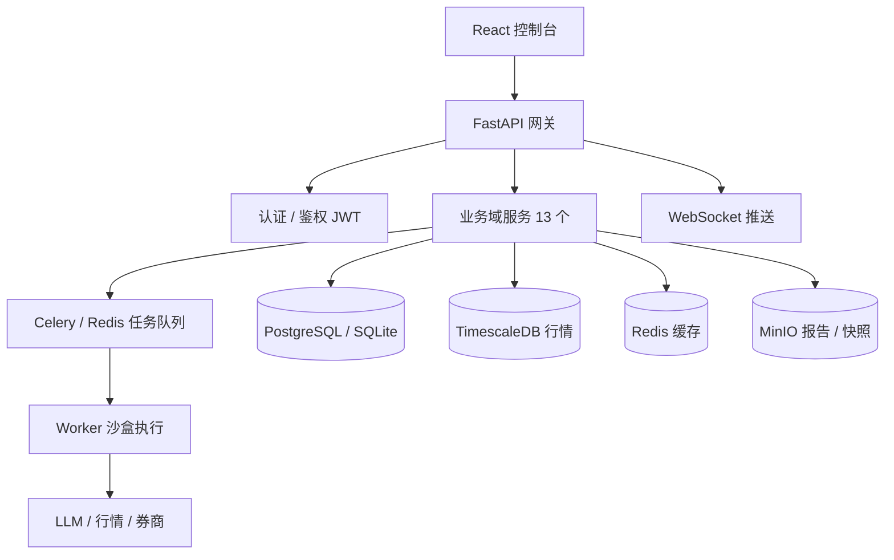

# LLMine Quant — AI-Native 量化投研与交易平台

> **AI-driven quantitative trading platform for Chinese A-share market.**
> 用大语言模型（LLM）把"自然语言策略想法"自动转化为可回测、可解释、可上线的量化交易策略。覆盖 **数据 → 研究 → 策略 → 回测 → 风控 → 模拟盘 → 实盘** 的完整闭环。

[](https://www.python.org/)
[](https://fastapi.tiangolo.com/)
[](https://react.dev/)
[](https://www.typescriptlang.org/)
[](https://www.sqlalchemy.org/)
[](#license)

**Keywords**: `AI Quant Trading` · `LLM Strategy Generation` · `A-Share Backtesting` · `Algorithmic Trading` · `量化交易` · `策略回测` · `AI 量化` · `多 Agent 协作` · `Anthropic Claude` · `OpenAI GPT` · `FastAPI` · `React` · `AKShare`

---

## 目录

- [项目简介](#项目简介)
- [核心特性](#核心特性)
- [系统架构](#系统架构)
- [技术栈](#技术栈)
- [快速开始](#快速开始)
- [项目结构](#项目结构)
- [核心模块](#核心模块)
- [文档导航](#文档导航)
- [开发规范](#开发规范)
- [Roadmap](#roadmap)
- [贡献](#贡献)
- [License](#license)

---

## 项目简介

**LLMine Quant** 是一款面向中国 A 股市场的 AI 原生量化投研与交易系统。它通过 **多 Agent 协作** 把自然语言形式的投资想法（"低估值高股息防御组合"、"小市值反转 + 风控熔断"等）自动翻译成可执行的量化策略，并经过偏见检测、滚动验证、风控评估后投入回测乃至实盘。

与传统量化平台相比，本项目的差异化在于：

| 维度       | 传统量化平台              | LLMine Quant                                    |
| ---------- | ------------------------- | ----------------------------------------------- |
| 策略研发   | 手写 Python，门槛高       | 自然语言 + LLM Agent 协作，分钟级出策略         |
| 回测质量   | 容易未来函数 / 过拟合     | 内置 **未来数据泄漏检测** + 滚动验证            |
| 信号解释   | 黑盒指标                  | **可解释归因** + 数据血缘追踪                   |
| 风控       | 静态规则                  | AI 风控 Agent 动态评估 + 熔断机制               |
| 协作       | 单兵作战                  | 多人分权 + AI 评审 Agent + 审计追踪             |

适用人群：私募 / 量化研究员、个人量化交易者、券商投顾团队、金融科技产品经理。

---

## 核心特性

- **AI 策略工厂** — 自然语言 → 策略 DSL → Python 代码，支持 Anthropic Claude、OpenAI GPT，缺少凭据时自动降级到 Mock。
- **回测实验室** — 真实日线数据回测，自动检测未来函数、生存者偏差，支持滚动窗口验证。
- **本地行情库** — 基于 AKShare 一键全市场同步（5500+ 只 A 股），SQLite 离线可用，KPI 实时统计。
- **股票元数据** — `stock_info` 表持久化中文名称、所属板块、ST 标记，支持代码 / 名称双向检索。
- **解释与血缘** — 每一笔信号可追溯到指标 → 数据源，输出可视化归因报告。
- **多 Agent 协作** — Strategy / Backtest / Risk / Explain / Audit 等专业 Agent 并行作业，可在前端"协作实验室"组合编排。
- **风控与熔断** — 策略上线前必须通过 AI 风控 Agent 评估，运行时具备实时熔断能力。
- **完整闭环** — 同一份策略在研究 / 回测 / 模拟盘 / 实盘之间无缝切换。
- **审计与合规** — 全链路操作日志，满足量化机构合规要求。

---

## 系统架构



**13 个业务域**: `strategy` · `backtest` · `data` · `portfolio` · `execution` · `risk` · `explain` · `security` · `collaboration` · `audit` · `agents` · `identity` · `dashboard`

**11 个前端业务屏**: 策略工厂 · 回测实验室 · 解释与血缘 · 组合驾驶舱 · 交易审批 · 风控与熔断 · 行情与合规 · 资金安全 · 协作实验室 · 审计追踪 · 模拟盘

---

## 技术栈

### 后端

| 类别       | 技术                                                |
| ---------- | --------------------------------------------------- |
| 语言       | Python 3.11+                                        |
| Web 框架   | FastAPI 0.115 (async)                               |
| ORM        | SQLAlchemy 2.0 + Alembic (async)                    |
| 数据校验   | Pydantic v2                                         |
| 任务队列   | Celery + Redis                                      |
| 数据库     | SQLite (dev) / PostgreSQL + TimescaleDB (prod)      |
| LLM        | Anthropic Claude · OpenAI GPT (auto-detect 凭据)    |
| 行情数据   | AKShare (新浪 / 东方财富)                           |
| 测试       | pytest + pytest-asyncio                             |
| Lint       | Ruff + Mypy                                         |

### 前端

| 类别       | 技术                                                |
| ---------- | --------------------------------------------------- |
| 语言       | TypeScript 6                                        |
| 框架       | React 19                                            |
| 构建工具   | Vite 8                                              |
| 状态管理   | React Context + Hooks（每个业务域一个 context）     |
| HTTP       | Axios（代理至 `:8000`）                             |
| 实时通信   | WebSocket                                           |
| Lint       | ESLint + typescript-eslint                          |

---

## 快速开始

### 环境要求

- Python ≥ 3.11
- Node.js ≥ 18
- （可选）Docker Desktop / PostgreSQL / Redis

### 1. 克隆仓库

```bash
git clone https://github.com/<your-org>/llmine-quant.git
cd llmine-quant
```

### 2. 启动后端

```bash
cd backend

# 安装依赖（含 dev 工具）
pip install -e ".[dev]"

# 配置环境
cp .env.example .env
# 默认即可使用 SQLite (sqlite+aiosqlite:///./llmine.db)

# 数据库迁移
alembic upgrade head

# 灌入开发种子数据
python scripts/seed_dev_data.py

# 启动 API（默认 http://127.0.0.1:8000）
uvicorn app.main:app --reload --host 0.0.0.0 --port 8000
```

打开 [http://127.0.0.1:8000/docs](http://127.0.0.1:8000/docs) 查看 OpenAPI 文档。

### 3. 启动前端

```bash
cd frontend

npm install
npm run dev
```

打开 [http://127.0.0.1:5173](http://127.0.0.1:5173) 进入控制台。Vite 已配置 `/api` 与 `/ws` 反向代理到 `:8000`。

### 4. （可选）一键拉取全市场行情

进入"数据"屏 → 点击"全市场同步"，约 10–20 分钟即可灌入 5500+ 只 A 股近 5 年日线（约几百万行）。
随后点击"名称库"按钮拉取股票中文名（5–10 秒）。

### 5. （可选）Docker Compose 启动完整栈

```bash
docker-compose -f deploy/docker-compose.yml up
```

会同时拉起 PostgreSQL + Redis + API。

---

## 项目结构

```
llmine-quant/
├── backend/                        # Python / FastAPI 后端
│   ├── app/
│   │   ├── api/v1/                 # HTTP & WebSocket 路由
│   │   ├── services/               # 业务逻辑（事务边界）
│   │   ├── domains/                # 13 个业务域（models + schemas）
│   │   ├── db/                     # AsyncSession + Alembic migrations
│   │   ├── integrations/           # LLM / 行情外部封装
│   │   ├── core/                   # config / logging / auth / errors
│   │   └── main.py
│   ├── scripts/                    # 行情同步、种子数据脚本
│   ├── tests/
│   └── pyproject.toml
├── frontend/                       # React / TypeScript 前端
│   ├── src/
│   │   ├── screens/                # 11 个业务屏
│   │   ├── contexts/               # 每个域一个 React Context
│   │   ├── components/             # 通用组件
│   │   ├── lib/api.ts              # Axios 客户端
│   │   └── data/                   # Mock 数据兜底
│   └── package.json
├── deploy/
│   └── docker-compose.yml
├── doc/                            # 产品 / 架构 / Roadmap
│   ├── prd/                        # 产品需求文档
│   ├── plan/                       # 阶段路线图
│   └── log/                        # 迭代实施日志
├── .qoder/repowiki/                # 中文 RepoWiki
├── CLAUDE.md                       # AI 协作规范
└── README.md
```

---

## 核心模块

| 模块                           | 主要文件                                                | 说明                                                   |
| ------------------------------ | ------------------------------------------------------- | ------------------------------------------------------ |
| **策略生成**                   | `app/services/strategy_generation.py`                   | LLM 驱动的策略生成与 DSL 校验                          |
| **回测引擎**                   | `app/services/daily_backtest.py`                        | 日线回测 + 未来函数防护                                |
| **行情全量同步**               | `app/services/market_data_full_sync.py`                 | AKShare 多进程拉日线 + UPSERT 落库                     |
| **股票元数据**                 | `app/domains/data/models.py::StockInfo`                 | symbol / 中文名 / 板块 / ST 标记                       |
| **本地行情库 UI**              | `frontend/src/screens/Data/LocalMarketLibrary.tsx`      | KPI 全库统计 + 双侧无限滚动 + 中文名展示               |
| **LLM Provider 抽象**          | `app/integrations/llm/`                                 | Anthropic / OpenAI / Mock 三档自动降级                 |
| **风控 Agent**                 | `app/domains/risk/`                                     | 策略上线前 AI 评估 + 运行时熔断                        |

---

## 文档导航

- **产品需求（PRD）**: [`doc/prd/`](doc/prd/) — 产品概述、系统架构、核心模块、A 股适配、实施路线图
- **阶段计划**: [`doc/plan/`](doc/plan/) — Phase 1–5 + Agent Studio MVP
- **迭代日志**: [`doc/log/`](doc/log/) — 每次大功能落地的实施记录
- **中文 RepoWiki**: [`.qoder/repowiki/zh/content/`](\.qoder/repowiki/zh/content/) — 项目概述、API 参考、前后端开发指南、故障排除
- **AI 协作规范**: [`CLAUDE.md`](CLAUDE.md) — Claude Code / Qoder 等 AI 编码助手的工作守则
- **OpenAPI Swagger**: 启动后端后访问 `http://127.0.0.1:8000/docs`

---

## 开发规范

- **后端**: Ruff（rules `E F I N W UP B C4 SIM ASYNC`）+ Mypy strict + 100% async DB 调用。
- **前端**: ESLint + typescript-eslint，禁用 `let x = 0; if(...) x=...` 风格，优先三元 / `const`。
- **错误处理**: 统一抛 `LLMineException`，由 `main.py` 注册的 handler 翻译为 HTTP 响应。
- **迁移**: 每次拉取新代码后必须执行 `alembic upgrade head`。
- **测试**: 新增业务逻辑必须带 `pytest` 单测，行情 / LLM 调用使用 Mock。
- **提交**: 遵循 Conventional Commits（`feat:` / `fix:` / `docs:` / `refactor:` …）。

详细规则参见 [`CLAUDE.md`](CLAUDE.md)。

---

## Roadmap

| 阶段     | 主题                          | 状态           |
| -------- | ----------------------------- | -------------- |
| Phase 1  | Research MVP                  | ✓ 完成         |
| Phase 2  | AI → Backtest 闭环            | ✓ 完成         |
| Phase 3  | 可靠性与可解释性              | 进行中         |
| Phase 4  | 模拟盘                        | 计划中         |
| Phase 5  | 实盘就绪                      | 计划中         |

详见 [`doc/plan/roadmap.md`](doc/plan/roadmap.md) 与 [`doc/plan/progress.md`](doc/plan/progress.md)。

---

## 贡献

欢迎通过 Issue / PR 协作：

1. Fork 本仓库并新建分支：`git checkout -b feat/your-feature`
2. 本地通过 `ruff check` / `mypy` / `pytest` / `npm run lint`
3. 提交时遵循 Conventional Commits
4. 发起 Pull Request 并描述动机与影响范围

提交前请阅读 [`CLAUDE.md`](CLAUDE.md) 了解整体协作规范。

---

## License

本项目目前为内部研发版本（Proprietary），如需商业使用请联系作者。

---

## 致谢

- [FastAPI](https://fastapi.tiangolo.com/) · [SQLAlchemy](https://www.sqlalchemy.org/) · [Pydantic](https://docs.pydantic.dev/) · [Alembic](https://alembic.sqlalchemy.org/)
- [React](https://react.dev/) · [Vite](https://vitejs.dev/) · [TypeScript](https://www.typescriptlang.org/)
- [AKShare](https://akshare.akfamily.xyz/) — 开放金融数据接口
- [Anthropic Claude](https://www.anthropic.com/) · [OpenAI](https://openai.com/) — LLM 能力提供方

---

> 如果这个项目对你有帮助，欢迎 ⭐ Star 支持。Issues、PR、交流均欢迎。
