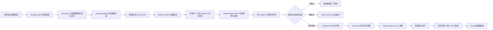
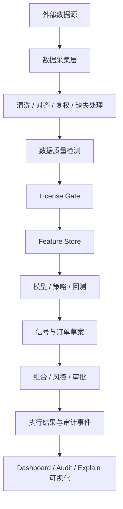
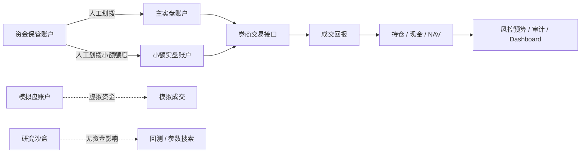

# LLMine Quant 高保真原型需求规格说明书

| 项目 | 内容 |
| --- | --- |
| 文档版本 | V1.0.0 |
| 编写日期 | 2026-05-10 |
| 依据范围 | `frontend/` 高保真原型、`frontend/src/data/types.ts`、A 股 / Crypto 双市场 Mock 数据 |
| 适用对象 | 产品、研发、算法、风控、交易、合规、测试 |
| 当前状态 | 原型需求沉淀版，用于后端 API、数据模型、权限体系和迭代计划拆解 |

## 1. 文档目标

本需求文档基于 `frontend` 目录下的高保真原型反向梳理，目标是把已实现的界面表达转化为可落地的产品需求、业务流程、数据流、资金流和系统设计基线。

本文档与现有文档的关系：

| 文档 | 作用 |
| --- | --- |
| `doc/prd/V1.0.0-前端产品需求文档.md` | 前端页面与组件功能基线 |
| `doc/01-产品概述与愿景.md` | 产品定位与业务愿景 |
| `doc/02-系统架构设计.md` | 后端、Agent、基础设施架构设想 |
| `doc/03-核心模块设计.md` | 核心业务模块设计 |
| `doc/04-A股特殊适配.md` | A 股市场规则适配 |
| 本文档 | 将高保真原型扩展为完整需求规格，补齐整体流程、数据流、资金流、详细设计和版本规划 |

## 2. 产品定位

LLMine Quant 是面向 A 股量化团队、私募投研团队和高阶个人投资者的 AI-Native 量化投研与交易控制台。产品通过多 Agent 协作，将自然语言策略想法转化为可验证、可解释、可审批、可执行、可审计的交易闭环。

核心定位：

| 定位维度 | 说明 |
| --- | --- |
| 产品形态 | Web 端 AI 量化作战室 |
| 核心对象 | 策略、回测、信号、组合、订单、资金账户、风控规则、数据源、审计事件 |
| 核心能力 | 自然语言策略生成、自动回测、样本外验证、数据血缘、信号归因、组合管理、交易审批、风险熔断、资金安全、审计追踪 |
| 当前市场 | 默认 A 股，保留 Crypto 双市场数据结构 |
| 交易原则 | AI 可生成建议和订单草案，实盘交易默认 Human-in-the-loop |
| 安全原则 | 资金不可出系统、密钥不可明文读取、审计不可篡改、风控不可绕过 |

## 3. 产品目标

### 3.1 用户目标

| 用户角色 | 目标 | 高频场景 |
| --- | --- | --- |
| 个人投资者 | 快速验证投资想法，降低代码门槛 | 用自然语言创建策略、查看回测、模拟盘验证 |
| 量化研究员 | 提升策略研发和参数迭代效率 | 批量回测、Walk-forward、参数热力图、版本评审 |
| 交易员 | 控制实盘执行风险和交易质量 | 审批订单、查看预交易检查、跟踪成交和滑点 |
| 风控人员 | 实时监控组合风险并执行熔断 | VaR、预算、违规历史、L1-L4 熔断器 |
| 合规人员 | 证明数据、决策、订单全链路可追溯 | 审计日志、数据血缘、HITL 规则、工具权限 |
| 运维/安全 | 保障数据源、密钥、账户和权限安全 | 数据源健康、Vault、AI 权限矩阵、安全事件 |

### 3.2 业务目标

| 阶段 | 目标 | 衡量指标 |
| --- | --- | --- |
| POC / 原型期 | 证明 AI 量化闭环体验成立 | 11 个核心屏幕完整、Mock 数据可切换、业务链路可讲通 |
| MVP | 打通真实数据、回测、模拟盘 | 自然语言到回测 < 5 分钟，模拟盘连续运行 1 周 |
| 实盘准备 | 引入交易审批和风控熔断 | 实盘订单 100% 可审计，违规订单自动拦截 |
| 机构版 | 多账户、多角色、多策略协作 | RBAC、生效审批流、审计报表、SLA 监控 |

## 4. 需求范围

### 4.1 当前原型范围

当前高保真原型覆盖 11 个一级模块：

| 模块 | 英文 Key | 核心职责 |
| --- | --- | --- |
| AI 指挥中心 | `dashboard` | 系统总览、市场、组合、Agent、告警、快捷入口 |
| 策略工厂 | `strategy` | 策略生成、模板、研发 Pipeline、策略矩阵 |
| 回测实验室 | `backtest` | 回测绩效、样本外、过拟合、压力测试、参数热力图 |
| 解释与血缘 | `explain` | 信号解释、因子归因、决策链、数据血缘、相似历史 |
| 组合驾驶舱 | `portfolio` | NAV、策略配置、风险预算、相关性、再平衡 |
| 交易审批 | `execution` | 待审批订单、预交易检查、订单簿、执行质量 |
| 风控与熔断 | `risk` | 风险预算、VaR、熔断器、策略流、违规历史 |
| 行情与合规 | `data` | 数据源、延迟、License Gate、数据质量、数据血缘 |
| 资金安全 | `security` | 账户分片、Vault、AI 权限、提现守卫、安全事件 |
| 协作实验室 | `collaboration` | 策略评审、版本 Diff、A/B 测试、审批流 |
| 审计追踪 | `audit` | 审计日志、Actor 行为、工具注册表、HITL 规则 |

### 4.2 当前原型不包含但后续必须建设

| 能力 | 原型状态 | 后续要求 |
| --- | --- | --- |
| 真实登录与权限 | 未实现 | 接入用户、角色、组织、权限、会话 |
| 后端 API | 未实现 | 由 Mock 数据迁移到 REST / WebSocket |
| 实时行情 | 未实现 | WebSocket 推送市场、订单、Agent、风险事件 |
| 真实回测引擎 | 未实现 | 接入策略执行、撮合、成本、绩效计算 |
| 策略代码编辑器 | 未实现 | Monaco / CodeMirror、版本管理、安全扫描 |
| 审批落库 | 未实现 | 审批流状态机、双签、多角色签名 |
| 真实交易接口 | 未实现 | QMT / PTrade / 券商 API |
| 报告导出 | 部分按钮展示 | 生成 PDF / HTML / CSV / 审计报告 |

## 5. 总体业务闭环

### 5.1 主流程

### 5.2 状态流转

| 对象 | 状态 | 触发条件 | 下一步 |
| --- | --- | --- | --- |
| 策略 | 草稿 | 用户输入自然语言或选择模板 | 静态检查 |
| 策略 | 静态检查 | 代码生成完成 | 通过后进入回测，不通过返回修改 |
| 策略 | 回测中 | Backtest Agent 接收任务 | 生成回测报告 |
| 策略 | 模拟盘 | OOS、Bias、Risk 达标 | A/B 测试或实盘候选 |
| 策略 | 实盘候选 | 模拟盘稳定且评审通过 | 进入交易审批 |
| 策略 | Live | 实盘审批通过并部署 | 持续风控和审计 |
| 策略 | Paused | 风控触发、数据异常、人工暂停 | 复核后恢复或下线 |

## 6. 数据流

### 6.1 原型中的数据分层

前端通过 `VITE_MARKET=ashare|crypto` 切换市场，A 股与 Crypto 使用同一份 `MockData` 类型。

### 6.2 数据源层级

| 层级 | 原型标签 | 用途 | 数据源示例 | 权限边界 |
| --- | --- | --- | --- | --- |
| 研究层 | `research` | 研究、历史回测、策略发现 | AKShare、Baostock、雪球、东方财富、巨潮 | Research Only，禁止进入实盘信号 |
| 模拟盘层 | `paper` | 模拟盘验证、备份行情、因子库 | Tushare Pro、iFinD、聚宽、北向资金、龙虎榜 | 可用于 Paper，不得直接用于 Live |
| 实盘层 | `live` | 实盘行情、交易前校验、订单执行 | 券商 Level-2、Wind Live、交易所授权数据 | Licensed，可进入实盘链路 |

### 6.3 数据质量需求

| 需求项 | 说明 | 验收标准 |
| --- | --- | --- |
| 延迟监控 | 展示平均延迟、P95 延迟、SLA 线 | 实盘行情 P95 小于配置 SLA |
| 缺失率监控 | 展示 24h 缺失率和数据源异常 | 缺失率超过阈值触发事件 |
| 漂移检测 | 比较字段分布、价格偏差、行业分类变化 | Drift Score 超阈值进入事件流 |
| License Gate | 根据数据源许可证控制使用范围 | Research Only 不得进入实盘信号 |
| 血缘追踪 | 从 Raw Data 到 Order Proposal 可追溯 | 每个信号必须有 Trace ID 和血缘节点 |
| Bias Gate | 幸存者偏差、未来函数、特征泄漏等检测 | Fail 时阻止进入模拟盘 / 实盘 |

### 6.4 核心数据对象

| 对象 | 关键字段 | 来源模块 | 消费模块 |
| --- | --- | --- | --- |
| MarketIndex | 名称、代码、价格、涨跌幅、成交额 | Data | Dashboard |
| Strategy | 名称、族系、状态、收益、回撤、夏普、OOS | Strategy | Dashboard、Backtest、Portfolio |
| BacktestReport | KPI、权益曲线、参数热力图、压力测试 | Backtest | Strategy、Collaboration、Risk |
| Signal | 操作、标的、仓位、置信度、风险等级、Trace ID | Explain | Execution、Audit |
| Portfolio | NAV、现金、杠杆、敞口、VaR、策略权重 | Portfolio | Dashboard、Risk、Execution |
| Approval | 标的、方向、数量、金额、限价、止损、原因、过期时间 | Execution | Risk、Audit |
| RiskPolicyEvent | 请求、决策、原因、耗时 | Risk | Audit、Dashboard |
| SecurityEvent | 类型、Actor、严重度、处理结果 | Security | Audit |
| AuditLog | 时间、Actor、动作、资源、结果、置信度、Trace ID | 全模块 | Audit |

## 7. 资金流

### 7.1 资金账户分层

原型在资金安全模块中明确展示了账户分片设计，资金安全要求如下：

| 账户 | 资金性质 | AI 权限 | 可交易 | 可出金 | 说明 |
| --- | --- | --- | --- | --- | --- |
| 资金保管账户 | 真实资金主账户 | 只读余额 | 否 | 人工柜台 | AI 不可操作，作为主资金池 |
| 主实盘账户 | 真实交易资金 | 读、提案 | 是 | 否 | 订单默认人工双签 |
| 小额实盘账户 | 小额真实资金 | 读、提案、有限执行 | 是 | 否 | 可对预授权策略开放小额自动执行 |
| 模拟盘账户 | 虚拟资金 | 完全自动 | 是 | 否 | AI 可自主执行，用于验证 |
| 研究沙盒 | 虚拟或无资金 | 回测 / 研究 | 否 | 否 | 与实盘网络隔离 |

### 7.2 资金流向

### 7.3 资金安全规则

| 规则 | 要求 |
| --- | --- |
| AI 不可提现 | 工具注册表中 `withdraw_funds`、`transfer_to_external` 永久禁止 |
| 密钥不可导出 | Vault / HSM 代理调用，禁止 `read_secret`、`export_key`、`decrypt_secret` |
| 实盘默认审批 | 所有主实盘订单必须人工确认，除非小额账户策略预授权 |
| 出金必须线下多签 | CFO、风控、合规三签，不通过 AI 系统执行 |
| 账户额度上限 | 主实盘、小额实盘分别设置资金上限和单笔上限 |
| 资金影响可视化 | 每笔订单展示 notional、notionalPct、DD 影响、Beta 影响、集中度影响 |
| 审计不可篡改 | 资金、订单、权限、密钥相关动作必须写入 Audit Log |

### 7.4 交易资金闭环

1. 策略生成信号，形成订单草案。
2. Risk Agent 计算资金占用、组合暴露、现金缓冲、杠杆、VaR。
3. Execution 展示订单名义金额、占 NAV 比例、限价、止损、置信度和影响。
4. 人工审批通过后，Execution Agent 通过券商 API 发送订单。
5. 成交回报更新现金、持仓、NAV、策略贡献和订单簿。
6. 风控模块重新计算风险预算，审计模块记录完整链路。

## 8. 权限流与 HITL

### 8.1 Agent 权限等级

| 等级 | 能力 | 审批要求 |
| --- | --- | --- |
| L0 | 读公共信息、读研究数据 | 自动 |
| L1 | 只读账户、持仓、订单、余额 | 自动并审计 |
| L2 | 运行回测、生成报告、参数搜索 | 自动并审计 |
| L3 | 模拟盘下单、策略模拟部署 | 自动或规则审批 |
| L4 | 创建实盘订单提案、风控变更提案 | 必须人工审批 |
| L5 | 小额实盘自动执行 | 仅预授权策略和额度内 |
| L6 | 读取密钥、禁用风控、修改审计、提现 | 永久禁止 |

### 8.2 人工介入条件

| 条件 | 处理方式 |
| --- | --- |
| Confidence < 0.8 | 转人工复核 |
| 任意实盘订单 | 默认人工审批 |
| 风控规则放宽 | 风控与合规双签 |
| Kill Switch 恢复 | 风控人员手动恢复 |
| 资金扩容 | CFO 双签 |
| 密钥轮换 | 安全团队确认，必要时双人审批 |
| License Gate 冲突 | 拒绝进入实盘，记录审计 |

## 9. 页面功能需求

### 9.1 全局框架

| 功能 | 需求 |
| --- | --- |
| 侧边栏导航 | 区分 Command 与 Control 两组导航，支持折叠 |
| 顶部搜索 | 支持自然语言输入，回车触发创建策略任务 |
| 全局状态 | 展示 Autopilot、Risk Gate、System Health |
| 全局概览 | 点击打开全局系统概览 Modal |
| Kill Switch | 点击打开全局熔断 Modal，真实版本需二次确认和权限校验 |
| 移动端 Tab | 小屏幕展示核心页面快捷切换 |

### 9.2 AI 指挥中心

| 功能点 | 说明 |
| --- | --- |
| 市场指数条 | 展示主要指数价格、涨跌幅、成交额 |
| 组合净值图 | 对比组合与基准收益，支持时间区间切换 |
| 组合 KPI | 总收益、年化、最大回撤、夏普、Sortino |
| Agent 矩阵 | 展示 Research、Strategy、Backtest、Risk、Execution 等 Agent 状态 |
| 告警队列 | 按审批、风险、系统分类，支持跳转目标模块 |
| 策略卡片 | 展示策略收益、状态、Sparkline、最近信号时间 |
| 快捷操作 | 新建策略、批量回测、风控检查、审批中心 |

### 9.3 策略工厂

| 功能点 | 说明 |
| --- | --- |
| Pipeline 状态条 | 草稿、静态检查、回测中、模拟盘、实盘候选数量 |
| 自然语言策略生成 | 输入投资想法、风险约束、市场范围、调仓频率 |
| 策略模板 | 保守、平衡、激进模板，支持 A 股市场描述 |
| Agent Feed | 展示各 Agent 对策略生成任务的处理过程 |
| 策略矩阵 | 年化、回撤、夏普、状态、OOS Score、最近更新时间 |
| 研发看板 | 以泳道展示策略从想法到上线的任务流 |

### 9.4 回测实验室

| 功能点 | 说明 |
| --- | --- |
| KPI 指标条 | 展示收益、回撤、胜率、夏普、盈亏比等 |
| 权益曲线 | 样本内、样本外、回撤多维展示 |
| 置信度塔 | 综合评分与过拟合、滑点、参数稳定性检查 |
| Walk-forward | 分折展示 IS/OOS 收益一致性 |
| 策略对比 | 多策略横向比较，支持跳转解释模块 |
| 压力测试 | 股灾、熊市、数据异常等情景损失评估 |
| 参数热力图 | 标注参数最优区间和稳定性 |

### 9.5 解释与血缘

| 功能点 | 说明 |
| --- | --- |
| 信号头 | 操作、标的、仓位、置信度、风险等级、Trace ID |
| 归因瀑布 | 展示正负因子对最终决策的贡献 |
| 置信雷达 | 从数据质量、模型稳定、风险匹配等维度评估 |
| 决策链 | 展示数据、模型、风险、组合、执行建议的链路 |
| 血缘图 | Raw Data -> Feature -> Model -> Signal -> Order |
| Bias Gate | 幸存者偏差、未来函数、特征泄漏、License Scope |
| 相似历史 | 匹配历史案例，展示胜率、平均收益和失败样本 |

### 9.6 组合驾驶舱

| 功能点 | 说明 |
| --- | --- |
| NAV 条 | 总资产、今日 PnL、MTD、YTD、现金、杠杆、VaR |
| 策略分配 | 策略权重、贡献、收益、状态 |
| 风险预算 | 单日亏损、回撤、集中度、Beta、相关性等预算 |
| 相关性矩阵 | 展示策略之间相关系数，识别拥挤交易 |
| 集中度分析 | 行业、持仓、因子暴露 |
| 再平衡建议 | 减仓、加仓、轮动、对冲建议，进入审批流 |

### 9.7 交易审批

| 功能点 | 说明 |
| --- | --- |
| 审批概览 | 待审批、紧急、阻塞、24h 已审批、延迟、成功率 |
| 审批队列 | 展示订单类型、标的、方向、数量、金额、限价、止损 |
| 批准 / 拒绝 / 推迟 | 操作需写入审计，真实版本需校验权限 |
| 预交易检查 | 单标的、行业、现金、杠杆、相关性、流动性 |
| 订单簿 | 历史订单状态、成交、拒绝、撤单、滑点、PnL |
| 执行质量 | 滑点分布、成交率、拒单原因 |
| Agent 轨迹 | 展示订单从生成到成交的每一步 |

### 9.8 风控与熔断

| 功能点 | 说明 |
| --- | --- |
| 风控头图 | 健康分、Kill Switch、最近事件、待审批、违规数 |
| 风险 KPI | 日内损益、实时回撤、拦截数、熔断状态、杠杆、Risk Gate |
| 风险预算 | 单股、行业、Beta、波动率、相关性、流动性、杠杆、回撤 |
| VaR 面板 | 日 VaR、周 VaR、置信度、历史走势、策略分解 |
| L1-L4 熔断 | 单笔限额、策略级、组合级、全局熔断 |
| Policy Stream | Agent 请求、决策、原因、耗时 |
| 违规历史 | 事件严重度、详情、解决方案、状态 |

### 9.9 行情与合规

| 功能点 | 说明 |
| --- | --- |
| 数据健康头图 | 总源数、活跃源、异常源、延迟、缺失率、健康分 |
| 数据层级卡片 | 研究层、模拟盘层、实盘层 |
| 数据源矩阵 | 提供商、层级、类型、覆盖率、延迟、缺失、漂移、License |
| 延迟趋势 | 研究 / 模拟 / 实盘三层延迟趋势与 SLA |
| 数据血缘 | 数据源、因子、模型、信号、订单草案的 DAG |
| Bias Gate | 未来函数、幸存者偏差、特征泄漏、License Gate |
| 事件时间线 | Outage、Missing、Drift、License、Schema 等事件 |

### 9.10 资金安全

| 功能点 | 说明 |
| --- | --- |
| 资金安全头图 | Vault、提现开关、密钥轮换、AI 越权、泄露统计 |
| 账户分片 | 保管、主实盘、小额实盘、模拟盘、沙盒 |
| Vault 状态 | API、钱包、SSH、Webhook、DB 密钥状态和到期时间 |
| AI 权限矩阵 | 展示允许和禁止调用的工具及原因 |
| 提现守卫 | 提现禁用、白名单、出金上限、双签、IP 白名单 |
| 安全事件 | 密钥轮换、越权拦截、访问审计、异常 IP |

### 9.11 协作实验室

| 功能点 | 说明 |
| --- | --- |
| 协作 KPI | 研究讨论、待评审、A/B 测试、权限分权 |
| 活跃评审 | 策略版本、状态、评审角色、优先级 |
| 版本 Diff | 字段级变更和影响评估 |
| 评审讨论 | 研究员、风控、交易、合规意见 |
| A/B 测试 | 对照组、实验组、状态、样本、提升率 |
| 审批流 | 研究提交、回测验证、风控评审、交易确认、合规审查、上线部署 |

### 9.12 审计追踪

| 功能点 | 说明 |
| --- | --- |
| 审计 KPI | 事件数、AI 决策、人工审批、异常检测、置信度、延迟 |
| 审计日志 | 时间、Actor、类型、动作、资源、结果、详情、Trace ID |
| Actor 分析 | 系统、Agent、人类操作量分布 |
| 工具注册表 | 工具权限等级、描述、可调用 Agent |
| HITL 规则 | 自动、复核、必须审批的规则清单 |

## 10. 详细设计

### 10.1 前端信息架构

| 区域 | 设计要求 |
| --- | --- |
| Sidebar | 固定左侧，承载产品品牌、Command 导航、Control 导航、系统健康卡 |
| Topbar | 固定顶部，承载自然语言输入、Autopilot、Risk Gate、全局概览、Kill Switch |
| Screen | 11 个屏幕以 `screen` 状态切换，当前原型未使用 URL 路由 |
| Modal | 统一弹窗承载全局概览、策略创建、交易审批、暂停、Kill Switch |
| Mobile Tabs | 小屏下保留核心路径：Dashboard、Strategy、Backtest、Explain、Execution、Risk |

### 10.2 交互设计要求

| 交互 | 要求 |
| --- | --- |
| 导航切换 | 切换后页面滚动到顶部 |
| 搜索回车 | 触发创建策略任务 Modal，后续版本应创建真实任务 |
| 告警点击 | 如果存在 target，则跳转至目标模块 |
| 审批按钮 | 原型打开 Modal，正式版本需要调用审批 API |
| Kill Switch | 原型展示说明，正式版本需二次确认、权限校验、操作留痕 |
| 筛选 Tab | 数据源、密钥、审计日志等表格支持客户端筛选 |
| 图表 | ECharts 图表需处理隐藏容器初始化和 ResizeObserver |

### 10.3 状态与颜色

| 语义 | Tone | 使用场景 |
| --- | --- | --- |
| 正常 / 通过 / 上涨 | green | Live、Pass、Resolved、Healthy |
| 注意 / 待审批 | yellow | Watch、Pending、Review、Approval |
| 危险 / 失败 / 下跌 | red | Denied、Fail、Critical、Kill |
| 信息 / 模拟 | blue | Paper、Info、System |
| AI / 特殊 / 草稿 | purple | Draft、AI、Trace、Special |
| 禁用 / 归档 | gray | Disabled、Canceled、Idle |

### 10.4 后端 API 设计建议

| 领域 | API 示例 | 说明 |
| --- | --- | --- |
| Dashboard | `GET /api/dashboard/overview` | 返回市场、组合、Agent、告警、策略摘要 |
| Strategy | `POST /api/strategies/tasks` | 创建自然语言策略任务 |
| Strategy | `GET /api/strategies` | 策略矩阵列表 |
| Backtest | `POST /api/backtests` | 发起回测 |
| Backtest | `GET /api/backtests/{id}/report` | 查询回测报告 |
| Explain | `GET /api/signals/{id}/explain` | 查询信号解释、归因、血缘 |
| Portfolio | `GET /api/portfolio/current` | 当前组合、NAV、风险预算 |
| Execution | `GET /api/approvals` | 待审批订单 |
| Execution | `POST /api/approvals/{id}/approve` | 批准订单 |
| Risk | `GET /api/risk/overview` | 风险预算、VaR、熔断器、违规 |
| Data | `GET /api/data/sources` | 数据源健康 |
| Security | `GET /api/security/vault` | Vault 和权限状态 |
| Collaboration | `GET /api/reviews` | 策略评审任务 |
| Audit | `GET /api/audit/logs` | 审计日志 |

### 10.5 WebSocket 事件建议

| 事件 | Payload |
| --- | --- |
| `market.tick` | 指数、标的、价格、成交量、时间 |
| `agent.status` | Agent、状态、任务、进度、健康分 |
| `strategy.pipeline.updated` | 策略 ID、阶段、进度、消息 |
| `backtest.completed` | 回测 ID、策略 ID、核心 KPI |
| `approval.created` | 审批 ID、订单摘要、过期时间 |
| `order.updated` | 订单 ID、状态、成交数量、滑点 |
| `risk.breach` | 违规事件、严重度、规则、建议动作 |
| `data.incident` | 数据源、事件类型、影响范围 |
| `security.event` | Actor、事件、严重度、处理状态 |
| `audit.appended` | Trace ID、Actor、动作、结果 |

## 11. 非功能需求

| 类型 | 需求 |
| --- | --- |
| 性能 | 首页首屏加载 < 2s，图表交互 < 100ms，WebSocket 延迟 < 1s |
| 可用性 | 核心交易审批、Kill Switch、风控面板可用性 99.9% |
| 安全 | 生产环境强制 HTTPS、JWT / SSO、RBAC、MFA、IP 白名单 |
| 审计 | 所有资金、订单、风控、密钥、权限动作必须 append-only |
| 合规 | 数据源使用必须经过 License Gate，保留数据血缘和权限证据 |
| 容错 | 数据源异常自动降级，实盘链路禁止使用未授权备份源 |
| 可观测 | 指标、日志、链路追踪、审计事件统一 Trace ID |
| 可测试 | 每个业务状态机需要单元测试、集成测试和回归样例 |

## 12. 未来规划

### 12.1 V1.0 原型固化

| 目标 | 交付 |
| --- | --- |
| 完成原型需求定稿 | 本文档、页面功能基线、数据模型基线 |
| 明确后端接口 | API 初稿、WebSocket 事件初稿 |
| 明确权限边界 | Agent 权限等级、HITL 规则、资金安全规则 |

### 12.2 V1.1 MVP

| 模块 | 规划 |
| --- | --- |
| 数据 | 接入 A 股日线、财务、基础行情数据，落地 Data Source 和 License Gate |
| 策略 | 自然语言创建策略任务，生成策略草案和参数空间 |
| 回测 | 可运行基础回测、绩效指标、回测报告 |
| Dashboard | 对接真实 API，展示真实任务和策略状态 |
| 审计 | 所有策略任务和回测任务写入审计日志 |

### 12.3 V1.2 模拟盘闭环

| 模块 | 规划 |
| --- | --- |
| Paper Trading | 模拟账户、模拟成交、模拟订单簿、成交回报 |
| 风控 | 账户级、组合级、策略级检查上线 |
| 解释 | 信号归因、Trace ID、数据血缘可查询 |
| 协作 | 策略评审、版本 Diff、A/B 测试 |

### 12.4 V1.3 实盘准备

| 模块 | 规划 |
| --- | --- |
| 交易 | 对接 QMT / PTrade / 券商 API 沙盒 |
| 审批 | 多角色审批流、双签、过期处理、撤销 |
| 安全 | Vault、密钥轮换、IP 白名单、Tool Registry |
| 风控 | L1-L4 熔断器真实状态机 |

### 12.5 V2.0 机构版

| 模块 | 规划 |
| --- | --- |
| 多租户 | 组织、团队、角色、策略空间隔离 |
| 多账户 | 母账户、子账户、策略账户、资金归集 |
| 合规报告 | 自动生成日 / 周 / 月风控和审计报告 |
| 插件生态 | 策略模板、数据源适配器、图表插件 |
| 移动审批 | 移动端审批、告警推送、紧急熔断 |

## 13. 验收标准

### 13.1 原型验收

| 验收项 | 标准 |
| --- | --- |
| 页面覆盖 | 11 个一级模块均可访问 |
| 市场切换 | `VITE_MARKET=ashare|crypto` 数据结构一致 |
| 页面联动 | Dashboard 告警、快捷操作可跳转目标模块或打开 Modal |
| 样式一致性 | 状态色、卡片、图表、标签语义统一 |
| 响应式 | 桌面端和移动端布局可用 |

### 13.2 MVP 验收

| 验收项 | 标准 |
| --- | --- |
| 自然语言策略 | 用户输入策略约束后生成任务和策略草案 |
| 回测报告 | 至少包含收益、回撤、夏普、胜率、权益曲线 |
| 数据合规 | Research Only 数据进入实盘链路时被阻断 |
| 风控检查 | 单笔、仓位、现金、杠杆、集中度规则可执行 |
| 审计追踪 | 关键动作具备 Trace ID 且可查询 |

### 13.3 实盘准备验收

| 验收项 | 标准 |
| --- | --- |
| 订单审批 | 实盘订单必须审批后发送 |
| 幂等执行 | 订单提交具备幂等键，重复提交不会重复下单 |
| 熔断机制 | L1-L4 规则可触发、可记录、可恢复 |
| 资金隔离 | AI 无法提现、无法读取明文密钥、无法绕过风控 |
| 审计报告 | 可按 Trace ID 导出策略到订单的全链路证据 |

## 14. 风险与待确认问题

| 风险 / 问题 | 影响 | 建议 |
| --- | --- | --- |
| 当前只有前端 Mock | 无法验证真实业务性能和数据一致性 | 优先定义 API Schema 并接入最小后端 |
| 策略代码执行安全 | AI 生成代码可能包含危险逻辑 | 沙盒执行、静态扫描、资源限额 |
| A 股交易规则复杂 | T+1、涨跌停、停牌、复权、手续费影响回测准确性 | 单独维护 A 股规则引擎 |
| 数据许可风险 | 免费数据源不可用于商业实盘 | 强制 License Gate 和数据源分层 |
| 实盘接口差异 | QMT / PTrade / 券商 API 能力不一致 | 抽象 Execution Adapter |
| 审批责任边界 | AI 建议与人工决策责任需要明确 | 明确 HITL 规则、签名和审计证据 |
| 风控误杀 / 漏杀 | 影响收益或资金安全 | 使用软硬阈值、灰度、事后复盘 |

## 15. 附录：原型文件映射

| 原型目录 / 文件 | 对应需求 |
| --- | --- |
| `frontend/src/App.tsx` | 全局布局、导航、Modal、屏幕状态 |
| `frontend/src/data/types.ts` | MockData 总数据模型 |
| `frontend/src/data/mock_ashare.ts` | A 股业务样例与需求语义 |
| `frontend/src/data/mock_crypto.ts` | Crypto 双市场扩展样例 |
| `frontend/src/screens/Dashboard` | AI 指挥中心 |
| `frontend/src/screens/Strategy` | 策略工厂 |
| `frontend/src/screens/Backtest` | 回测实验室 |
| `frontend/src/screens/Explain` | 解释与血缘 |
| `frontend/src/screens/Portfolio` | 组合驾驶舱 |
| `frontend/src/screens/Execution` | 交易审批 |
| `frontend/src/screens/Risk` | 风控与熔断 |
| `frontend/src/screens/Data` | 行情与合规 |
| `frontend/src/screens/Security` | 资金安全 |
| `frontend/src/screens/Collaboration` | 协作实验室 |
| `frontend/src/screens/Audit` | 审计追踪 |

