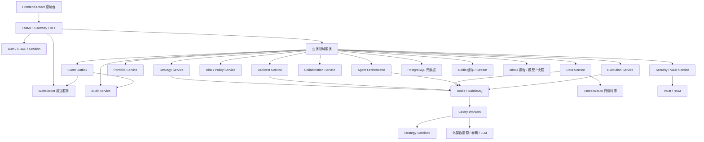
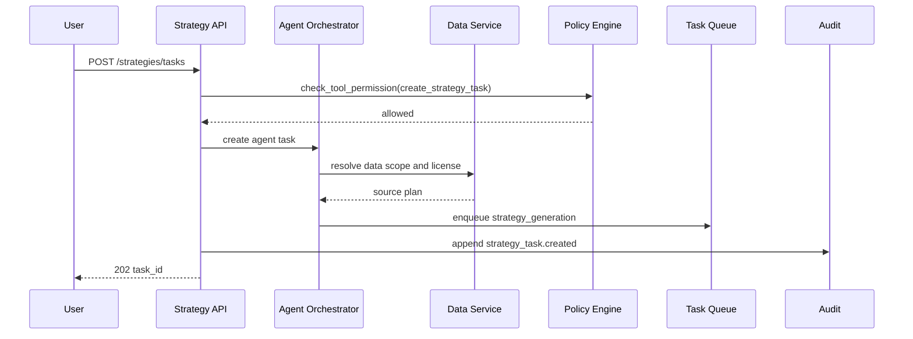
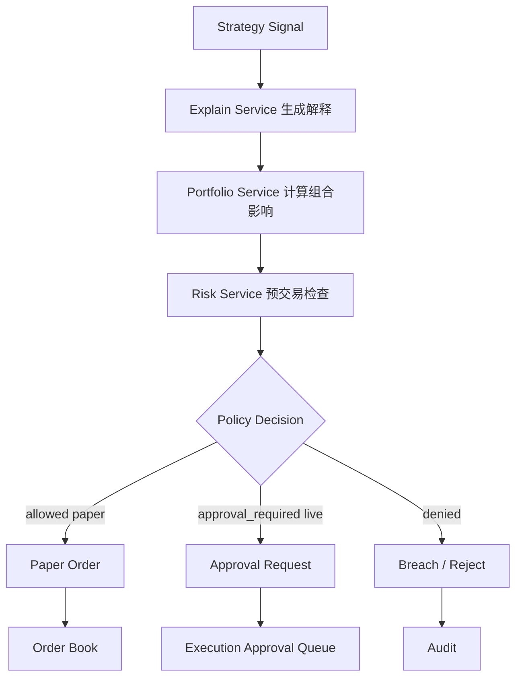
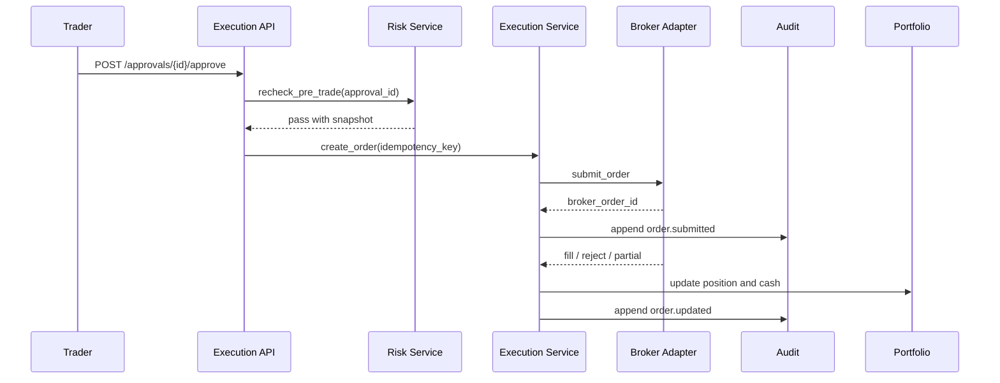
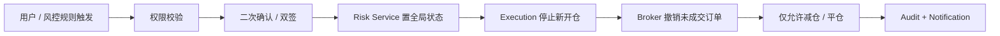

# LLMine Quant 后端项目设计说明书

| 项目 | 内容 |
| --- | --- |
| 文档版本 | V1.0.0 |
| 编写日期 | 2026-05-10 |
| 设计依据 | `doc/06-高保真原型需求规格说明书.md`、`doc/02-系统架构设计.md`、`doc/03-核心模块设计.md` |
| 适用范围 | 后端工程、API、数据库、任务系统、Agent 编排、风控、交易、安全、审计 |
| 推荐技术栈 | Python 3.11+、FastAPI、PostgreSQL、TimescaleDB、Redis、Celery、MinIO、Vault |

## 1. 设计目标

后端项目需要把前端高保真原型表达的 11 个业务模块落成可运行、可审计、可扩展的服务系统。V1 阶段优先采用“模块化单体 + 异步任务 + 事件总线”的架构，避免过早拆分微服务，同时在代码目录、数据库模型、事件协议和权限边界上预留未来拆分空间。

核心目标：

| 目标 | 说明 |
| --- | --- |
| 支撑前端 11 屏 | 为 Dashboard、Strategy、Backtest、Explain、Portfolio、Execution、Risk、Data、Security、Collaboration、Audit 提供 API |
| 打通 MVP 闭环 | 自然语言策略任务 -> 数据校验 -> 策略草案 -> 回测 -> 风控 -> 模拟盘 -> 审计 |
| 建立安全边界 | AI 不可提现、不可读密钥、不可绕过风控、实盘默认审批 |
| 建立可追溯链路 | 所有关键对象带 `trace_id`，资金、订单、风控、密钥动作 append-only 审计 |
| 支持 A 股规则 | T+1、涨跌停、停牌、ST、复权、手续费、印花税、数据许可分层 |
| 便于未来拆分 | Agent、Backtest、Data Pipeline、Execution Adapter 可独立部署 |

## 2. 架构原则

| 原则 | 后端设计落点 |
| --- | --- |
| 模块化单体优先 | 一个 FastAPI 应用，按 bounded context 拆模块，降低初期部署复杂度 |
| 领域边界清晰 | 每个业务域有独立 `api / models / schemas / services / repositories / tasks` |
| 同步 API + 异步任务 | 查询和轻操作走 REST，长任务走 Celery，状态通过事件和 WebSocket 推送 |
| 事件驱动审计 | 关键状态变化先落业务表，再写 Outbox，异步分发并写审计 |
| 策略代码沙盒 | AI 生成代码和用户策略必须在隔离 worker 执行 |
| 风控前置 | 任何订单、模拟盘部署、实盘候选上线前必须调用 Policy / Risk |
| 数据许可强约束 | Data Source 的 license scope 进入策略、回测、信号、订单全链路 |
| 幂等优先 | 任务创建、审批、下单、回报处理都必须支持幂等键 |

## 3. 总体架构



## 4. 推荐仓库结构

后端建议新增 `backend/` 目录。初期不要把每个模块拆成独立服务，先用清晰的包边界保证可维护。

```text
backend/
  pyproject.toml
  README.md
  Dockerfile
  alembic.ini
  app/
    main.py
    api/
      v1/
        router.py
        dashboard.py
        strategies.py
        backtests.py
        signals.py
        portfolio.py
        execution.py
        risk.py
        data.py
        security.py
        collaboration.py
        audit.py
        websocket.py
    core/
      config.py
      logging.py
      security.py
      permissions.py
      errors.py
      tracing.py
      time.py
    db/
      session.py
      base.py
      migrations/
    domains/
      identity/
        models.py
        schemas.py
        service.py
        repository.py
      strategy/
        models.py
        schemas.py
        service.py
        repository.py
        state_machine.py
      backtest/
        models.py
        schemas.py
        service.py
        repository.py
        metrics.py
        engine/
      data/
        models.py
        schemas.py
        service.py
        repository.py
        adapters/
        quality.py
        lineage.py
        license_gate.py
      portfolio/
        models.py
        schemas.py
        service.py
        repository.py
        optimizer.py
      execution/
        models.py
        schemas.py
        service.py
        repository.py
        adapters/
        idempotency.py
      risk/
        models.py
        schemas.py
        service.py
        repository.py
        policy_engine.py
        circuit_breaker.py
      explain/
        models.py
        schemas.py
        service.py
        repository.py
      collaboration/
        models.py
        schemas.py
        service.py
        repository.py
        workflow.py
      security/
        models.py
        schemas.py
        service.py
        repository.py
        vault_client.py
        tool_registry.py
      audit/
        models.py
        schemas.py
        service.py
        repository.py
        merkle.py
      agents/
        models.py
        schemas.py
        orchestrator.py
        registry.py
        tools.py
        prompts/
    tasks/
      celery_app.py
      strategy_tasks.py
      backtest_tasks.py
      data_tasks.py
      portfolio_tasks.py
      execution_tasks.py
      risk_tasks.py
      report_tasks.py
    events/
      bus.py
      outbox.py
      schemas.py
      publishers.py
      consumers.py
    integrations/
      llm/
      market_data/
      brokers/
      notification/
      object_storage/
    sandbox/
      runner.py
      policy.py
      resource_limits.py
    tests/
      unit/
      integration/
      contract/
      e2e/
  scripts/
    seed_dev_data.py
    create_admin.py
    run_worker.py
  deploy/
    docker-compose.yml
    prometheus.yml
    grafana/
```

## 5. 模块边界

| 模块 | 职责 | 关键对象 | 可拆服务时机 |
| --- | --- | --- | --- |
| Identity | 用户、组织、角色、权限、会话 | User、Org、Role、Permission、Session | 多租户上线前 |
| Dashboard | 聚合首页数据 | Overview、Alert、AgentStatus | 保持 BFF 聚合层即可 |
| Strategy | 策略创建、版本、Pipeline | Strategy、StrategyVersion、StrategyTask | 策略生成任务量增大 |
| Backtest | 回测任务、指标、报告 | BacktestTask、BacktestRun、BacktestReport | 回测计算资源独立扩缩容 |
| Data | 数据源、质量、血缘、许可 | DataSource、MarketBar、FeatureSet、LineageNode | 行情接入变为实时高吞吐 |
| Explain | 信号解释、归因、相似历史 | Signal、Attribution、DecisionChain | 与模型解释服务独立部署 |
| Portfolio | 账户组合、NAV、权重、再平衡 | Portfolio、Position、NAVSnapshot | 多账户或组合优化计算变重 |
| Execution | 审批、订单、成交、执行质量 | Approval、Order、Fill、ExecutionMetric | 接入真实券商前可独立隔离 |
| Risk | 风控规则、Policy、熔断、违规 | RiskRule、RiskCheck、CircuitBreaker、Breach | 进入实盘前必须独立高可用 |
| Security | Vault、密钥、工具注册、资金安全 | SecretRef、ToolPermission、SecurityEvent | 生产安全域独立部署 |
| Collaboration | 评审、版本 Diff、A/B 测试、审批流 | Review、Diff、ABTest、Workflow | 团队协作功能复杂后 |
| Audit | 审计日志、Merkle、导出 | AuditLog、AuditChain、Report | 进入实盘前独立只写服务 |
| Agents | 多 Agent 编排、工具调用、任务状态 | AgentTask、AgentMessage、ToolCall | Agent 工作流复杂后 |

## 6. 核心业务流程设计

### 6.1 自然语言创建策略



输出要求：

| 产物 | 说明 |
| --- | --- |
| StrategyTask | 自然语言任务、用户约束、Agent 状态 |
| StrategyDraft | 策略草案、参数空间、依赖数据源 |
| RiskSuggestion | 初始风控规则建议 |
| AuditLog | 创建任务、权限检查、数据许可结果 |

### 6.2 回测任务


关键约束：

| 约束 | 说明 |
| --- | --- |
| 策略代码不可访问生产网络 | 沙盒禁网或只开放数据读取代理 |
| 读取数据必须带 usage scope | `research`、`paper`、`live` 分级 |
| 参数搜索必须限额 | 最大组合数、CPU 时间、内存、运行时长 |
| 回测报告不可覆盖 | 每次运行生成独立 `backtest_run_id` |
| OOS 与 Walk-forward 必须记录 | 用于策略进入模拟盘的准入条件 |

### 6.3 信号到订单草案



### 6.4 实盘审批与执行



必须满足：

| 项 | 要求 |
| --- | --- |
| 审批前重检 | 审批时重新计算价格、现金、仓位、风险预算 |
| 幂等下单 | 使用 `idempotency_key`，重复点击不会重复提交 |
| 订单状态机 | `draft -> pending_approval -> approved -> submitted -> working -> partially_filled -> filled / rejected / canceled` |
| Broker Adapter | 隔离 QMT、PTrade、券商 API 差异 |
| 成交回报 | 回报先落 `fills`，再更新持仓和 NAV |

### 6.5 Kill Switch



Kill Switch 规则：

| 场景 | 动作 |
| --- | --- |
| L1 单笔超限 | 自动拒单或转人工 |
| L2 策略级回撤 | 冻结策略新开仓，仅允许减仓 |
| L3 组合级风险 | 降低仓位，暂停杠杆，要求风控确认 |
| L4 全局熔断 | 拒收新订单、撤销未成交、恢复必须人工审批 |

## 7. 数据库设计

### 7.1 数据库分工

| 存储 | 用途 |
| --- | --- |
| PostgreSQL | 元数据、用户、策略、任务、订单、审批、审计、权限 |
| TimescaleDB | K 线、Tick、行情指标、NAV 时序、VaR 历史 |
| Redis | 缓存、任务状态、分布式锁、WebSocket presence、限流 |
| Redis Stream / RabbitMQ | 领域事件、Agent 消息、任务事件 |
| MinIO | 回测报告、图表快照、模型文件、策略包、审计导出 |
| Vault / HSM | API Key、券商凭证、数据库密钥、Webhook token |

### 7.2 通用字段规范

所有核心业务表建议包含：

| 字段 | 类型 | 说明 |
| --- | --- | --- |
| `id` | UUID / ULID | 主键，建议 ULID 便于时间排序 |
| `org_id` | UUID | 组织隔离 |
| `created_at` | timestamptz | 创建时间 |
| `updated_at` | timestamptz | 更新时间 |
| `created_by` | UUID nullable | 创建人或系统 Actor |
| `updated_by` | UUID nullable | 更新人 |
| `trace_id` | varchar | 链路追踪 ID |
| `metadata` | jsonb | 扩展信息 |
| `deleted_at` | timestamptz nullable | 软删除，仅非审计表可用 |

### 7.3 核心表清单

#### Identity

| 表 | 说明 | 关键字段 |
| --- | --- | --- |
| `organizations` | 组织 / 租户 | `name`、`status`、`plan` |
| `users` | 用户 | `email`、`name`、`status`、`mfa_enabled` |
| `roles` | 角色 | `name`、`scope` |
| `permissions` | 权限点 | `code`、`resource`、`action` |
| `user_roles` | 用户角色 | `user_id`、`role_id` |
| `sessions` | 登录会话 | `user_id`、`token_hash`、`expires_at`、`ip` |

#### Strategy

| 表 | 说明 | 关键字段 |
| --- | --- | --- |
| `strategy_tasks` | 自然语言策略任务 | `prompt`、`market`、`risk_profile`、`status`、`agent_task_id` |
| `strategies` | 策略主表 | `name`、`family`、`type`、`status`、`owner_id` |
| `strategy_versions` | 策略版本 | `strategy_id`、`version`、`code_uri`、`params_schema`、`risk_rules` |
| `strategy_pipeline_events` | Pipeline 事件 | `strategy_id`、`stage`、`event`、`progress` |
| `strategy_templates` | 策略模板 | `name`、`risk_level`、`market`、`template_uri` |

#### Backtest

| 表 | 说明 | 关键字段 |
| --- | --- | --- |
| `backtest_tasks` | 回测任务 | `strategy_version_id`、`config`、`status`、`priority` |
| `backtest_runs` | 单次运行 | `task_id`、`params`、`started_at`、`ended_at`、`status` |
| `backtest_metrics` | 指标 | `run_id`、`annual_return`、`max_drawdown`、`sharpe`、`oos_score` |
| `backtest_equity_points` | 权益曲线 | `run_id`、`trade_date`、`value`、`benchmark`、`drawdown` |
| `backtest_stress_results` | 压测结果 | `run_id`、`scenario`、`loss`、`max_drawdown`、`suggestion` |
| `backtest_reports` | 报告 | `run_id`、`report_uri`、`summary`、`artifact_hash` |

#### Data

| 表 | 说明 | 关键字段 |
| --- | --- | --- |
| `data_sources` | 数据源 | `name`、`provider`、`tier`、`license_scope`、`status` |
| `data_source_health` | 健康快照 | `source_id`、`latency_ms`、`missing_pct`、`drift_score` |
| `market_bars_daily` | 日线行情 | `symbol`、`trade_date`、`open`、`high`、`low`、`close`、`volume` |
| `market_bars_minute` | 分钟行情 | `symbol`、`ts`、`open`、`high`、`low`、`close`、`volume` |
| `corporate_actions` | 复权 / 除权 | `symbol`、`ex_date`、`factor`、`action_type` |
| `feature_sets` | 特征集 | `name`、`version`、`permission_scope`、`lineage_hash` |
| `feature_values` | 特征值 | `feature_set_id`、`symbol`、`as_of`、`values` |
| `lineage_nodes` | 血缘节点 | `node_type`、`label`、`version`、`permission` |
| `lineage_edges` | 血缘边 | `from_node_id`、`to_node_id` |
| `data_incidents` | 数据事件 | `source_id`、`type`、`severity`、`status`、`resolution` |

#### Portfolio

| 表 | 说明 | 关键字段 |
| --- | --- | --- |
| `accounts` | 账户 | `name`、`role`、`broker`、`is_live`、`cap_amount` |
| `portfolios` | 组合 | `name`、`base_currency`、`status` |
| `portfolio_accounts` | 组合账户关系 | `portfolio_id`、`account_id`、`weight` |
| `positions` | 持仓 | `account_id`、`symbol`、`quantity`、`avg_cost`、`market_value` |
| `cash_balances` | 现金 | `account_id`、`currency`、`available`、`frozen` |
| `nav_snapshots` | NAV 快照 | `portfolio_id`、`ts`、`nav`、`pnl`、`leverage` |
| `rebalance_proposals` | 再平衡建议 | `portfolio_id`、`type`、`reason`、`impact`、`status` |

#### Execution

| 表 | 说明 | 关键字段 |
| --- | --- | --- |
| `approvals` | 审批单 | `resource_type`、`resource_id`、`status`、`expires_at`、`risk_snapshot` |
| `approval_steps` | 审批步骤 | `approval_id`、`role`、`assignee_id`、`decision` |
| `order_proposals` | 订单草案 | `strategy_id`、`symbol`、`side`、`qty`、`notional`、`limit_price` |
| `orders` | 订单 | `proposal_id`、`broker_order_id`、`status`、`idempotency_key` |
| `fills` | 成交回报 | `order_id`、`price`、`qty`、`commission`、`slippage_bps` |
| `execution_metrics` | 执行指标 | `account_id`、`window`、`fill_rate`、`avg_slippage_bps` |

#### Risk

| 表 | 说明 | 关键字段 |
| --- | --- | --- |
| `risk_rules` | 风控规则 | `scope`、`metric`、`threshold`、`action`、`enabled` |
| `risk_checks` | 风控检查记录 | `resource_type`、`resource_id`、`result`、`snapshot` |
| `risk_budgets` | 风险预算 | `portfolio_id`、`metric`、`limit_value`、`used_value` |
| `var_snapshots` | VaR 快照 | `portfolio_id`、`ts`、`daily_var`、`weekly_var`、`confidence` |
| `circuit_breakers` | 熔断器 | `level`、`trigger`、`action`、`status` |
| `risk_breaches` | 违规事件 | `severity`、`title`、`detail`、`resolution`、`status` |
| `policy_decisions` | Policy 决策 | `actor`、`request`、`decision`、`reason`、`duration_ms` |

#### Explain

| 表 | 说明 | 关键字段 |
| --- | --- | --- |
| `signals` | 策略信号 | `strategy_id`、`symbol`、`action`、`size`、`confidence` |
| `signal_attributions` | 信号归因 | `signal_id`、`factor`、`value`、`description` |
| `decision_chain_steps` | 决策链 | `signal_id`、`step_no`、`title`、`detail` |
| `similar_history_cases` | 相似历史 | `signal_id`、`case_date`、`return_pct`、`success` |

#### Security

| 表 | 说明 | 关键字段 |
| --- | --- | --- |
| `secret_refs` | 密钥引用 | `label`、`provider`、`vault_path`、`scope`、`expires_at` |
| `tool_registry` | 工具注册表 | `name`、`level`、`enabled`、`description` |
| `tool_permissions` | 工具权限 | `tool_id`、`agent_type`、`permission`、`requires_approval` |
| `security_events` | 安全事件 | `type`、`actor`、`severity`、`detail`、`status` |
| `withdrawal_rules` | 出金规则 | `name`、`status`、`enforced` |

#### Collaboration

| 表 | 说明 | 关键字段 |
| --- | --- | --- |
| `reviews` | 策略评审 | `strategy_id`、`from_version`、`to_version`、`status` |
| `review_comments` | 评审讨论 | `review_id`、`author_role`、`content`、`tag` |
| `version_diffs` | 版本 Diff | `review_id`、`field`、`from_value`、`to_value`、`impact` |
| `ab_tests` | A/B 测试 | `name`、`control_id`、`variant_id`、`status`、`duration` |
| `workflow_instances` | 审批流实例 | `type`、`resource_id`、`status` |
| `workflow_steps` | 审批流步骤 | `workflow_id`、`stage`、`assignee`、`completed` |

#### Audit / Events

| 表 | 说明 | 关键字段 |
| --- | --- | --- |
| `audit_logs` | 不可变审计日志 | `actor`、`actor_type`、`action`、`resource`、`result`、`trace_id` |
| `audit_chain` | Merkle / Hash 链 | `audit_log_id`、`prev_hash`、`hash` |
| `event_outbox` | 事件 outbox | `event_type`、`payload`、`status`、`published_at` |
| `idempotency_keys` | 幂等记录 | `key`、`scope`、`request_hash`、`response_body` |

## 8. API 设计

### 8.1 API 规范

| 项 | 规范 |
| --- | --- |
| Base URL | `/api/v1` |
| 认证 | Bearer JWT，生产可接 SSO |
| 时间格式 | ISO 8601，统一 UTC 存储，前端按用户时区展示 |
| 金额 | Decimal 字符串或整数分，不使用 float 表示资金 |
| 分页 | `page`、`page_size`、`total`，大列表支持 cursor |
| 错误格式 | `code`、`message`、`details`、`trace_id` |
| 幂等 | 敏感写接口支持 `Idempotency-Key` |
| 审计 | 写接口默认生成审计事件 |

### 8.2 Dashboard API

| Method | Path | 说明 |
| --- | --- | --- |
| GET | `/dashboard/overview` | 首页聚合：市场、组合、Agent、告警、策略 |
| GET | `/dashboard/alerts` | 告警队列，支持 `type`、`severity` |
| GET | `/dashboard/system-health` | 系统健康、Autopilot、Risk Gate |

### 8.3 Strategy API

| Method | Path | 说明 |
| --- | --- | --- |
| POST | `/strategies/tasks` | 创建自然语言策略任务 |
| GET | `/strategies/tasks/{task_id}` | 查询策略任务状态和 Agent Feed |
| GET | `/strategies` | 策略矩阵列表 |
| POST | `/strategies` | 创建策略草案 |
| GET | `/strategies/{strategy_id}` | 策略详情 |
| POST | `/strategies/{strategy_id}/versions` | 创建策略版本 |
| POST | `/strategies/{strategy_id}/submit-review` | 提交协作评审 |
| POST | `/strategies/{strategy_id}/pause` | 暂停策略 |

### 8.4 Backtest API

| Method | Path | 说明 |
| --- | --- | --- |
| POST | `/backtests` | 创建回测任务 |
| GET | `/backtests/{task_id}` | 回测任务状态 |
| GET | `/backtests/{task_id}/runs` | 参数搜索运行列表 |
| GET | `/backtests/runs/{run_id}/report` | 回测报告 |
| GET | `/backtests/runs/{run_id}/equity` | 权益曲线 |
| GET | `/backtests/runs/{run_id}/stress` | 压力测试结果 |
| POST | `/backtests/{task_id}/cancel` | 取消回测 |

### 8.5 Explain API

| Method | Path | 说明 |
| --- | --- | --- |
| GET | `/signals/{signal_id}/explain` | 信号头、归因、置信雷达、决策链 |
| GET | `/signals/{signal_id}/lineage` | 信号数据血缘 |
| GET | `/signals/{signal_id}/similar-history` | 相似历史 |
| POST | `/signals/{signal_id}/approve` | 从解释页进入审批 |

### 8.6 Portfolio API

| Method | Path | 说明 |
| --- | --- | --- |
| GET | `/portfolios/current` | 当前组合总览 |
| GET | `/portfolios/{portfolio_id}/nav` | NAV 序列 |
| GET | `/portfolios/{portfolio_id}/allocation` | 策略分配 |
| GET | `/portfolios/{portfolio_id}/risk-budget` | 风险预算 |
| GET | `/portfolios/{portfolio_id}/correlation` | 相关性矩阵 |
| GET | `/portfolios/{portfolio_id}/concentration` | 集中度 |
| GET | `/portfolios/{portfolio_id}/rebalance-proposals` | 再平衡建议 |
| POST | `/rebalance-proposals/{id}/approve` | 批准再平衡建议 |

### 8.7 Execution API

| Method | Path | 说明 |
| --- | --- | --- |
| GET | `/execution/summary` | 审批统计 |
| GET | `/approvals` | 待审批队列 |
| POST | `/approvals/{id}/approve` | 批准 |
| POST | `/approvals/{id}/reject` | 拒绝 |
| POST | `/approvals/{id}/defer` | 推迟 |
| GET | `/execution/pre-trade-checks` | 预交易检查 |
| GET | `/orders` | 订单簿 |
| GET | `/orders/{order_id}` | 订单详情 |
| POST | `/orders/{order_id}/cancel` | 撤单 |
| GET | `/execution/metrics` | 执行质量 |
| GET | `/execution/agent-trace` | Agent 轨迹 |

### 8.8 Risk API

| Method | Path | 说明 |
| --- | --- | --- |
| GET | `/risk/overview` | 风控头图、KPI、预算、VaR、熔断 |
| GET | `/risk/budgets` | 风险预算矩阵 |
| GET | `/risk/var` | VaR 面板 |
| GET | `/risk/circuit-breakers` | L1-L4 熔断器 |
| POST | `/risk/circuit-breakers/{level}/trigger` | 手动触发熔断 |
| POST | `/risk/circuit-breakers/{level}/recover` | 申请恢复 |
| GET | `/risk/policy-stream` | Policy 决策流 |
| GET | `/risk/breaches` | 违规历史 |

### 8.9 Data API

| Method | Path | 说明 |
| --- | --- | --- |
| GET | `/data/overview` | 数据健康总览 |
| GET | `/data/sources` | 数据源矩阵 |
| POST | `/data/sources` | 新增数据源 |
| GET | `/data/sources/{id}/health` | 数据源健康 |
| GET | `/data/latency-trend` | 延迟趋势 |
| GET | `/data/lineage` | 数据血缘 |
| GET | `/data/bias-gates` | Bias Gate 状态 |
| GET | `/data/incidents` | 数据事件 |

### 8.10 Security API

| Method | Path | 说明 |
| --- | --- | --- |
| GET | `/security/overview` | 资金安全总览 |
| GET | `/security/accounts` | 账户分片 |
| GET | `/security/vault` | Vault 状态 |
| POST | `/security/secrets/{id}/rotate` | 发起密钥轮换 |
| GET | `/security/tool-registry` | AI 工具权限矩阵 |
| GET | `/security/withdrawal-guard` | 提现守卫 |
| GET | `/security/events` | 安全事件 |

### 8.11 Collaboration API

| Method | Path | 说明 |
| --- | --- | --- |
| GET | `/reviews` | 活跃评审 |
| POST | `/reviews` | 创建评审 |
| GET | `/reviews/{id}` | 评审详情 |
| POST | `/reviews/{id}/comments` | 添加评审意见 |
| POST | `/reviews/{id}/decision` | 提交评审决策 |
| GET | `/ab-tests` | A/B 测试列表 |
| POST | `/ab-tests` | 创建 A/B 测试 |
| GET | `/workflows/{id}` | 审批流 |

### 8.12 Audit API

| Method | Path | 说明 |
| --- | --- | --- |
| GET | `/audit/logs` | 审计日志 |
| GET | `/audit/actors` | Actor 分析 |
| GET | `/audit/tool-registry` | 工具注册表 |
| GET | `/audit/hitl-rules` | HITL 规则 |
| GET | `/audit/traces/{trace_id}` | 全链路追踪 |
| POST | `/audit/reports` | 创建审计报告导出任务 |

## 9. WebSocket 与事件设计

### 9.1 WebSocket 通道

| 通道 | 事件 |
| --- | --- |
| `/ws/dashboard` | `market.tick`、`agent.status`、`alert.created` |
| `/ws/strategy` | `strategy.pipeline.updated`、`agent.message` |
| `/ws/backtest` | `backtest.progress`、`backtest.completed` |
| `/ws/execution` | `approval.created`、`order.updated`、`execution.metric.updated` |
| `/ws/risk` | `risk.breach`、`circuit.triggered`、`policy.decision` |
| `/ws/data` | `data.health.updated`、`data.incident` |
| `/ws/security` | `security.event`、`vault.rotation.required` |
| `/ws/audit` | `audit.appended` |

### 9.2 领域事件

| 事件 | 触发模块 | 消费方 |
| --- | --- | --- |
| `strategy.task.created` | Strategy | Agent、Audit、WebSocket |
| `strategy.version.created` | Strategy | Backtest、Collaboration、Audit |
| `backtest.completed` | Backtest | Strategy、Risk、Collaboration、WebSocket |
| `signal.generated` | Strategy | Explain、Portfolio、Risk |
| `approval.created` | Execution | WebSocket、Notification、Audit |
| `approval.decided` | Execution | Execution、Audit、Risk |
| `order.submitted` | Execution | Portfolio、Audit、WebSocket |
| `order.filled` | Execution | Portfolio、Risk、Audit |
| `risk.breach.created` | Risk | Dashboard、Notification、Audit |
| `circuit.triggered` | Risk | Execution、Dashboard、Audit |
| `data.incident.created` | Data | Risk、Dashboard、Audit |
| `security.event.created` | Security | Audit、Notification |

### 9.3 Outbox 机制

写业务表和写事件 Outbox 必须在同一数据库事务中完成。事件发布器异步扫描 `event_outbox`，发布成功后更新状态。

```text
业务请求
  -> 校验权限
  -> 写业务表
  -> 写 event_outbox
  -> commit
  -> 后台 publisher 发布事件
  -> WebSocket / Audit / Notification 消费
```

## 10. 权限与安全设计

### 10.1 RBAC 角色

| 角色 | 权限重点 |
| --- | --- |
| Admin | 组织配置、用户管理、系统配置 |
| Researcher | 创建策略、运行回测、查看研究数据 |
| Trader | 查看订单、审批交易、撤单、执行复盘 |
| RiskOfficer | 风控规则、熔断、风险审批、恢复审批 |
| Compliance | 审计、数据许可、策略上线合规确认 |
| SecurityOfficer | 密钥轮换、工具权限、安全事件处理 |
| Viewer | 只读 Dashboard、报告、审计摘要 |

### 10.2 Agent 工具权限

| 工具 | 等级 | 默认策略 |
| --- | --- | --- |
| `get_market_data` | L1 | 允许，受数据 license scope 限制 |
| `run_backtest` | L2 | 允许，限额并审计 |
| `submit_paper_order` | L3 | 允许，需风控通过 |
| `create_live_order_proposal` | L4 | 允许创建提案，必须人工审批 |
| `submit_live_order` | L5 | 默认禁止，仅小额预授权 |
| `read_secret` | L6 | 永久禁止 |
| `withdraw_funds` | L6 | 永久禁止 |
| `disable_risk_check` | L6 | 永久禁止 |
| `modify_audit_log` | L6 | 永久禁止 |

### 10.3 安全控制

| 控制项 | 要求 |
| --- | --- |
| 密钥管理 | 业务表只存 `secret_ref`，明文只在 Vault / HSM 内使用 |
| 生产访问 | IP 白名单、MFA、最小权限 |
| 策略沙盒 | 禁止访问生产 DB，限制 CPU、内存、文件、网络 |
| 资金接口 | 不提供提现和外部转账 API |
| 审计日志 | append-only，禁止 update / delete |
| 风控规则 | 放宽必须审批，禁用规则需高权限双签 |
| 数据许可 | 后端强制校验，不依赖前端隐藏按钮 |

## 11. Agent 编排设计

### 11.1 Agent 类型

| Agent | 输入 | 输出 |
| --- | --- | --- |
| Research Agent | 市场观察、自然语言主题 | 研究假设、候选因子、数据需求 |
| Strategy Agent | 策略意图、模板、约束 | 策略草案、参数空间、风控建议 |
| Backtest Agent | 策略版本、参数、数据范围 | 回测报告、过拟合评估 |
| Data Agent | 数据请求、usage scope | 数据集、质量报告、血缘 |
| Risk Agent | 策略、组合、订单草案 | 风险评估、Policy 决策、熔断建议 |
| Execution Agent | 已审批订单 | 订单状态、成交回报、异常报告 |
| Explainability Agent | 信号、模型、数据血缘 | 因子归因、决策链、解释报告 |
| Portfolio Agent | 策略候选、资金约束 | 权重建议、再平衡建议 |

### 11.2 Agent 消息协议

```json
{
  "message_id": "msg_01H...",
  "trace_id": "TRACE-20260510-000001",
  "task_id": "task_01H...",
  "from_agent": "strategy_agent",
  "to_agent": "backtest_agent",
  "type": "task.request",
  "priority": 3,
  "payload": {},
  "created_at": "2026-05-10T10:00:00Z"
}
```

### 11.3 Agent 任务状态

| 状态 | 说明 |
| --- | --- |
| `queued` | 已入队 |
| `running` | 执行中 |
| `waiting_tool` | 等待工具返回 |
| `waiting_human` | 等待人工确认 |
| `blocked` | 被 Policy / Risk 阻断 |
| `succeeded` | 完成 |
| `failed` | 失败 |
| `canceled` | 取消 |

## 12. 回测引擎设计

### 12.1 回测分层

| 层 | 职责 |
| --- | --- |
| Config Layer | 回测周期、初始资金、基准、成本模型、A 股规则 |
| Data Layer | 获取清洗后行情、基本面、因子、复权因子 |
| Strategy Layer | 调用策略 `initialize / before_trading / generate_signals / on_order_status` |
| Broker Simulator | 撮合、手续费、印花税、滑点、涨跌停、T+1 |
| Portfolio Layer | 现金、持仓、权益曲线、风险指标 |
| Metrics Layer | 年化、回撤、夏普、Sortino、胜率、换手 |
| Validation Layer | IS/OOS、Walk-forward、Bias Gate、压力测试 |

### 12.2 A 股交易规则

| 规则 | 设计要求 |
| --- | --- |
| T+1 | 当日买入不可当日卖出 |
| 涨跌停 | 涨停不可买入或按可成交量限制，跌停不可卖出或按可成交量限制 |
| 停牌 | 停牌日不可交易，持仓估值沿用规则可配置 |
| ST / 退市 | 标记并可配置是否纳入股票池 |
| 新股 | 上市 N 日内可配置禁入 |
| 复权 | 回测价格使用复权价，成交和订单展示可用未复权价 |
| 成本 | 佣金、最低佣金、印花税、过户费、滑点模型 |

## 13. 风控与 Policy Engine

### 13.1 风控检查层级

| 层级 | 示例 |
| --- | --- |
| 账户级 | 现金、单账户资金上限、单笔金额、交易权限 |
| 组合级 | 最大回撤、VaR、Beta、杠杆、行业集中度、策略相关性 |
| 策略级 | 单策略回撤、胜率恶化、数据质量、信号置信度 |
| 订单级 | 单标的仓位、ADV、涨跌停、限价合理性、重复订单 |
| 数据级 | License Scope、延迟、缺失率、漂移 |

### 13.2 Policy 决策

| 决策 | 含义 |
| --- | --- |
| `allowed` | 自动允许 |
| `modified` | 调整参数后允许 |
| `approval_required` | 需要人工审批 |
| `denied` | 拒绝 |

每次决策必须记录：

| 字段 | 说明 |
| --- | --- |
| `actor` | 请求方，人或 Agent |
| `request` | 请求摘要 |
| `decision` | 决策 |
| `reason` | 原因 |
| `duration_ms` | 耗时 |
| `snapshot` | 输入快照 |
| `trace_id` | 链路 ID |

## 14. 资金与执行设计

### 14.1 账户分片

| 账户类型 | 后端权限 |
| --- | --- |
| `custody` | 只读余额，不可交易，不可提现 |
| `live-main` | 可生成实盘订单提案，必须审批 |
| `live-small` | 预授权策略可小额执行 |
| `paper` | AI 可自动模拟交易 |
| `sandbox` | 只允许研究和回测 |

### 14.2 Execution Adapter

统一接口：

```python
class BrokerAdapter:
    def submit_order(self, order_request): ...
    def cancel_order(self, broker_order_id): ...
    def get_order(self, broker_order_id): ...
    def get_positions(self, account_ref): ...
    def get_cash(self, account_ref): ...
```

适配器要求：

| 要求 | 说明 |
| --- | --- |
| 幂等 | 同一 `client_order_id` 不重复下单 |
| 回报标准化 | 不同券商回报统一成 `OrderStatus`、`Fill` |
| 超时处理 | 提交超时后必须查询确认，不能盲目重试 |
| 熔断响应 | 全局熔断时禁止新开仓，并尝试撤销未成交订单 |

## 15. 审计设计

### 15.1 审计范围

必须审计：

| 类型 | 示例 |
| --- | --- |
| 身份权限 | 登录、登出、角色变更、权限变更 |
| 策略 | 创建任务、生成代码、版本提交、状态变化 |
| 数据 | 数据源变更、License Gate 阻断、血缘变更 |
| 回测 | 创建任务、运行完成、报告生成 |
| 风控 | Policy 决策、违规、熔断、恢复 |
| 交易 | 审批、下单、撤单、成交、拒单 |
| 安全 | 密钥轮换、越权调用、Vault 访问 |
| Agent | 工具调用、被拒绝的能力、人工介入 |

### 15.2 审计日志不可变

| 机制 | 说明 |
| --- | --- |
| Append-only | 只允许 insert，不允许 update/delete |
| Hash Chain | 每条记录包含上一条 hash |
| 定期快照 | 每日生成审计链 root hash |
| 导出校验 | 报告导出包含 hash 和时间范围 |

## 16. 可观测性

| 维度 | 指标 |
| --- | --- |
| API | QPS、P95、错误率、鉴权失败、限流次数 |
| 任务 | 队列长度、任务耗时、失败率、重试次数 |
| 回测 | 运行时长、内存、参数组合数、沙盒失败 |
| 数据 | 延迟、缺失率、漂移、可用源数 |
| 交易 | 审批延迟、成交率、滑点、拒单原因 |
| 风控 | 拦截数、违规数、熔断次数、Policy 耗时 |
| 安全 | 越权次数、密钥临期、Vault 调用失败 |
| 审计 | 写入延迟、hash 校验失败、导出任务 |

日志字段标准：

| 字段 | 说明 |
| --- | --- |
| `trace_id` | 全链路 ID |
| `request_id` | API 请求 ID |
| `actor_id` | 用户或 Agent |
| `org_id` | 租户 |
| `resource_type` | 资源类型 |
| `resource_id` | 资源 ID |
| `event` | 事件名 |
| `duration_ms` | 耗时 |

## 17. 测试策略

| 测试类型 | 覆盖 |
| --- | --- |
| 单元测试 | 风控规则、状态机、指标计算、权限判断 |
| 集成测试 | API + DB、Celery、Redis、Outbox、WebSocket |
| 合约测试 | 前端需要的 API Schema、MockData 对齐 |
| 回测基准测试 | 经典策略与预期结果误差校验 |
| A 股规则测试 | T+1、涨跌停、停牌、复权、费用 |
| 安全测试 | 越权调用、密钥读取、提现接口不可达 |
| 幂等测试 | 审批、下单、回报重复请求 |
| E2E 测试 | 策略创建 -> 回测 -> 审批 -> 模拟成交 -> 审计 |

## 18. 部署设计

### 18.1 开发环境

```text
docker compose up
  - api
  - worker
  - postgres
  - redis
  - minio
  - vault-dev
```

### 18.2 生产环境建议

| 服务 | 部署要求 |
| --- | --- |
| API | 至少 2 副本，无状态 |
| Worker | 按队列拆分：backtest、data、execution、agent |
| PostgreSQL | 主从 + PITR 备份 |
| TimescaleDB | 单独资源池，按时间分区 |
| Redis | 哨兵或托管高可用 |
| MinIO | 多副本对象存储 |
| Vault | 生产必须使用真实 KMS / HSM 解封 |
| Execution Worker | 与普通 worker 隔离，IP 白名单 |
| Audit | 独立权限，只写账号 |

## 19. 版本实施计划

### 19.1 Milestone 1：后端骨架与前端 Mock 替换

| 交付 | 内容 |
| --- | --- |
| FastAPI 工程 | 健康检查、配置、日志、错误处理、OpenAPI |
| 数据库骨架 | Alembic、基础表、seed 数据 |
| Dashboard API | 返回与前端 MockData 对齐的真实 API |
| Audit 基础 | 写接口生成审计日志 |

### 19.2 Milestone 2：策略与回测 MVP

| 交付 | 内容 |
| --- | --- |
| Strategy Service | 策略任务、策略版本、Pipeline |
| Backtest Service | 基础回测任务、指标、报告 |
| Data Service | A 股日线数据接入、清洗、License Gate |
| Agent Skeleton | Agent 任务状态、消息流、工具调用审计 |

### 19.3 Milestone 3：模拟盘与风控

| 交付 | 内容 |
| --- | --- |
| Paper Account | 模拟账户、订单、成交、持仓 |
| Risk Service | 三层风控、Policy 决策、风险预算 |
| Portfolio Service | NAV、权重、相关性、再平衡 |
| Explain Service | 信号解释、归因、血缘查询 |

### 19.4 Milestone 4：实盘准备

| 交付 | 内容 |
| --- | --- |
| Execution Approval | 多角色审批、幂等下单、订单状态机 |
| Broker Sandbox | QMT / PTrade 沙盒适配 |
| Security Service | Vault、Tool Registry、密钥轮换流程 |
| Circuit Breaker | L1-L4 熔断器和恢复审批 |

## 20. 风险与决策记录

| 风险 | 影响 | 决策 |
| --- | --- | --- |
| 过早微服务化 | 增加运维复杂度 | V1 使用模块化单体，保留拆分边界 |
| AI 策略代码安全 | 可能访问敏感资源 | 沙盒执行，禁网，资源限额，静态扫描 |
| 实盘接口不一致 | 订单状态和回报难统一 | Broker Adapter 标准化 |
| 数据许可误用 | 合规风险 | License Gate 作为后端强校验 |
| 审批重复点击 | 重复下单风险 | 敏感写接口强制幂等 |
| 审计可篡改 | 合规证据失效 | append-only + hash chain |
| A 股规则遗漏 | 回测失真 | 单独建设 A 股规则测试集 |

## 21. 附录：前端页面到后端模块映射

| 前端页面 | 后端 API 模块 | 后端领域模块 |
| --- | --- | --- |
| AI 指挥中心 | `dashboard.py` | Dashboard、Portfolio、Strategy、Risk、Audit |
| 策略工厂 | `strategies.py` | Strategy、Agents、Data、Risk |
| 回测实验室 | `backtests.py` | Backtest、Data、Risk |
| 解释与血缘 | `signals.py` | Explain、Data Lineage、Audit |
| 组合驾驶舱 | `portfolio.py` | Portfolio、Risk、Execution |
| 交易审批 | `execution.py` | Execution、Risk、Portfolio、Audit |
| 风控与熔断 | `risk.py` | Risk、Policy、Execution |
| 行情与合规 | `data.py` | Data、Lineage、License Gate |
| 资金安全 | `security.py` | Security、Vault、Tool Registry |
| 协作实验室 | `collaboration.py` | Collaboration、Workflow、Strategy |
| 审计追踪 | `audit.py` | Audit、Security、All Domains |

