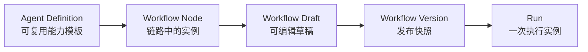
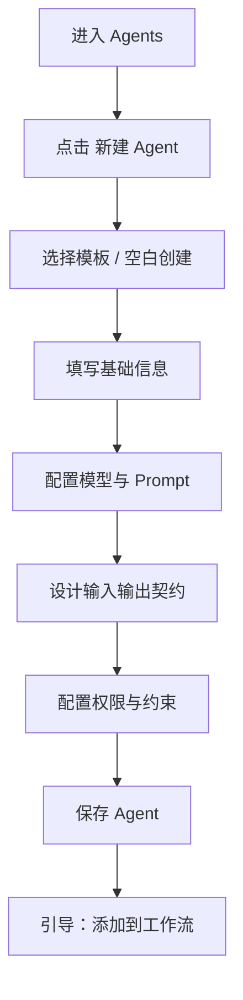
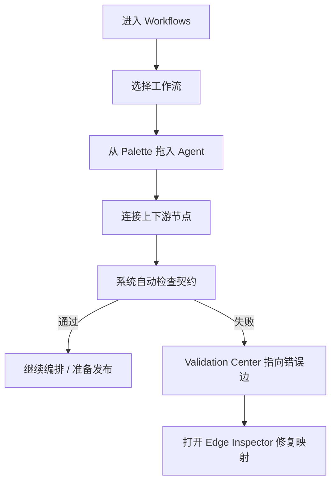
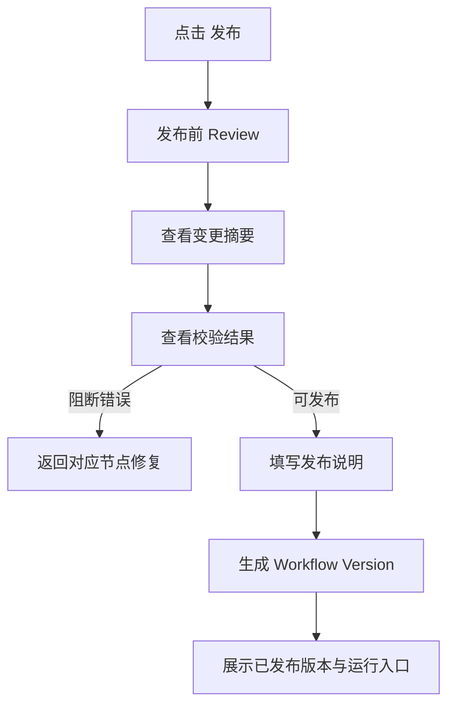
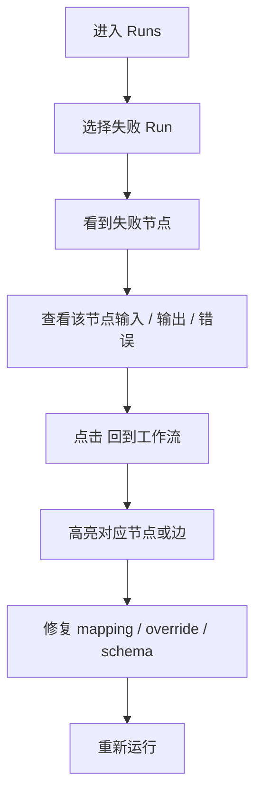

# Agent Studio UX Design v1

> 日期：2026-05-16  
> 目标：为下一阶段 Agent 模块前端重构提供统一的信息架构、页面结构和核心交互依据。  
> 结论先行：**Agent Studio 不应继续作为一个“全功能单页”，而应拆成 Agent / Workflow / Runs 三个工作区。**

---

## 1. 当前页面的真实问题

当前 Agent 页面已经具备功能，但存在 4 个根本性问题。

### 1.1 四种任务混在同一页面

当前页面同时承担：

1. Agent 定义维护
2. 工作流编排
3. 发布管理
4. 运行调试

这些任务的用户心智完全不同，却被堆在一个滚动页面里，导致用户进入后不知道当前主任务是什么。

### 1.2 对象层级不清楚

用户实际上在操作 4 类对象：

| 对象 | 本质 |
|---|---|
| Agent Definition | 可复用能力模板 |
| Workflow Node | Agent 在某条链路中的实例 |
| Workflow Version | 某次冻结后的可发布配置 |
| Run | 某次执行实例 |

当前 UI 中这四者虽然功能上都存在，但视觉上没有被明确区分。  
结果就是用户容易把：

- 改 Agent
- 改某个节点 override
- 改当前草稿
- 改已发布版本

混为一谈。

### 1.3 JSON 能力直接暴露，门槛过高

完整配置必须保留，这是对的。  
但当前很多复杂字段直接以 JSON 形式出现，更像“内部管理后台”，不够像面向研究员 / 管理员的产品界面。

### 1.4 反馈存在，但不够行动导向

现在已经有：

- 链路校验
- 发布状态
- 调试结果

但反馈仍偏“告诉你发生了什么”，而不是“告诉你接下来该怎么修”。

---

## 2. 核心设计判断

### 2.1 不建议继续做单页增强

有三种可选方向：

| 方向 | 优点 | 问题 |
|---|---|---|
| A. 保持单页，只优化布局 | 改动最小 | 根本问题不解决，功能越多越乱 |
| B. 单页 + 顶部模式切换 | 比现在清晰 | 仍然容易互相污染，Runs 仍像附属能力 |
| C. 拆为 Agent / Workflow / Runs 三工作区 | 心智最清楚，最适合长期演进 | 需要一次结构性重构 |

**推荐方向：C。**

原因：

- 与用户任务天然一致
- 能清晰表达对象关系
- 未来加 HITL、版本对比、运行回放时不需要再推翻

---

## 3. 核心对象关系



### 用户必须被 UI 教会的 4 件事

1. **Agent 是模板，不等于节点**
2. **节点可以在工作流里有自己的 override**
3. **发布的是工作流版本，不是当前页面状态**
4. **运行基于某个版本或某个草稿，不等于配置本身**

---

## 4. 推荐信息架构

```text
Agent Studio
├── Overview
│   ├── Agent 数量
│   ├── 工作流数量
│   ├── 最近发布
│   ├── 最近失败运行
│   └── 待处理问题
├── Agents
│   ├── Agent Library
│   ├── Agent Detail
│   └── Agent Editor
├── Workflows
│   ├── Workflow List
│   ├── Workflow Builder
│   ├── Validation Center
│   └── Publish Review
└── Runs
    ├── Debug Run
    ├── Run History
    └── Failure Replay
```

### 顶层导航建议

| 一级入口 | 用户问题 |
|---|---|
| Overview | 现在整体健康吗？ |
| Agents | 我有哪些可复用 Agent？ |
| Workflows | 我的链路怎么编排？ |
| Runs | 这条链路刚才怎么跑的？ |

---

## 5. 三个核心页面线框

## 5.1 Agent Library / Editor

```text
┌──────────────────────────────────────────────────────────────┐
│ Agent Studio / Agents                         [新建 Agent]   │
├──────────────┬───────────────────────────────────────────────┤
│ 搜索 / 筛选   │ Backtest Agent                 [编辑] [复制] │
│              │ role: backtest   status: active              │
│ Agent 列表    ├───────────────────────────────────────────────┤
│ ┌──────────┐ │ 概览卡片                                      │
│ │ Research │ │ 目标 / 下游 / 最近使用工作流                  │
│ │ Strategy │ ├───────────────────────────────────────────────┤
│ │ Backtest │ │ Tabs: 基础 | 模型 | Prompt | 契约 | 权限       │
│ │ Risk     │ │                                               │
│ └──────────┘ │ [默认表单视图]              [专家 JSON 模式]  │
│              │                                               │
│ 模板 / 标签   │ 结构化表单 + 预览 + 校验                      │
└──────────────┴───────────────────────────────────────────────┘
```

### 关键交互

- 左侧列表支持搜索、角色筛选、模板标签
- 中间详情默认是“阅读态”
- 点击编辑后进入“结构化表单”
- JSON 不消失，但退到“专家模式”
- Schema 不应默认直接裸露 JSON，而应先显示字段表

---

## 5.2 Workflow Builder

```text
┌──────────────────────────────────────────────────────────────┐
│ Workflow / 默认交易链路   草稿 v1.0.1   [校验] [发布] [运行] │
├──────────────┬───────────────────────────────┬──────────────┤
│ Node Palette │                               │ Inspector    │
│              │           Canvas              │              │
│ Research     │   [Research] ───▶ [Strategy]  │ 选中节点信息 │
│ Strategy     │        │                      │ 输入 / 输出  │
│ Backtest     │        ▼                      │ override     │
│ Risk         │     [Risk]                    │ 快速操作     │
│              │                               │              │
│ Templates    │    缩放 / Fit / Mini-map      │              │
├──────────────┴───────────────────────────────┴──────────────┤
│ Validation Center：2 errors · 1 warning    [查看全部问题]    │
└──────────────────────────────────────────────────────────────┘
```

### 关键交互

- 节点从左侧 palette 拖入
- 节点之间自然拖线
- 选中节点 / 边后右侧 inspector 改变
- 边上直接显示：
  - 映射数
  - 有效 / 缺失
- 画布底部常驻 Validation Center
- 发布与运行作为顶部主动作，不再埋在页面下方

---

## 5.3 Runs

```text
┌──────────────────────────────────────────────────────────────┐
│ Runs / 调试与回放                                             │
├──────────────┬───────────────────────────────┬──────────────┤
│ Run 列表      │ 当前 Run 时间线                │ 节点详情      │
│              │                               │              │
│ 成功 #1024    │ 1 Research   ✓  320ms         │ 输入          │
│ 失败 #1023    │ 2 Strategy   ✓  640ms         │ 输出          │
│ 调试 #1022    │ 3 Backtest   ✗  schema error   │ 错误          │
│              │                               │              │
│ [新建调试运行] │ [payload 编辑器] [重新运行]   │ 回到工作流节点│
└──────────────┴───────────────────────────────┴──────────────┘
```

### 关键交互

- 调试运行不再只是页面底部 textarea
- Run 列表、节点时间线、节点详情三栏结构
- 失败节点可一键跳回 Workflow Builder
- 展示输入 / 输出 diff，减少用户来回猜

---

## 6. 四条核心用户流

## 6.1 新建 Agent



### 设计重点

- 初次创建应是向导，而不是把全部 JSON 一次性铺开
- 保存成功后给出下一步动作，不让用户停在死胡同

---

## 6.2 接入工作流



### 设计重点

- 连线之后立即给反馈
- 错误不应藏在侧栏角落，而应能直接把用户带到问题点

---

## 6.3 校验并发布



### 设计重点

- 发布不应只是一个按钮，而应是“签字前复核”
- 用户必须看清本次版本相对上一版改了什么

---

## 6.4 调试失败并修复



### 设计重点

- “从失败到修复”必须是一条闭环
- 不能让用户自己记住节点名再回画布里找

---

## 7. 关键组件建议

| 组件 | 作用 |
|---|---|
| `AgentCard` | 列表态展示 Agent 基本信息、角色、使用状态 |
| `AgentEditorShell` | 统一承载基础 / 模型 / Prompt / 契约 / 权限 |
| `PromptEditor` | 变量提示、模板预览、片段插入 |
| `SchemaEditor` | 字段表 / JSON 双视图 |
| `WorkflowNodeCard` | 节点类型、风险、状态、输入输出摘要 |
| `EdgeMappingBadge` | 显示映射是否完整 |
| `ValidationCenter` | 聚合问题、跳转修复 |
| `PublishReviewDrawer` | 发布前 review |
| `RunTimeline` | 节点级运行时间线 |
| `RunNodeDetail` | 输入、输出、错误、跳回画布 |

---

## 8. 状态设计

以下状态必须在 UI 上被明确表达：

| 状态 | 表达建议 |
|---|---|
| `draft` | 黄色 / 中性，表示可编辑未发布 |
| `published` | 绿色，表示存在稳定版本 |
| `dirty` | 草稿已改动但未发布 |
| `invalid` | 有阻断问题 |
| `running` | 当前执行中 |
| `failed` | 执行失败 |
| `empty` | 无 Agent / 无工作流 / 无运行记录 |

尤其要区分：

- `published`
- `dirty`
- `invalid`

这三个状态不能只靠文案变化，最好在页面顶层都有持续可见的视觉反馈。

---

## 9. 我建议的实现优先级

### P0：先改结构，不先改装饰

1. 将页面拆成 `Agents / Workflows / Runs`
2. 把发布和校验提升为 Workflow 顶层动作
3. 把 Run 从附属区域提升为独立页面

### P1：降低配置门槛

4. Agent 编辑器改为结构化表单 + 专家 JSON 模式
5. Schema Editor 做字段表 / JSON 双视图
6. Prompt Editor 增加变量提示和预览

### P2：提升画布专业度

7. 节点 palette
8. 画布 zoom / fit / minimap
9. 边映射 badge
10. Validation Center

### P3：再做精细化

11. 发布前 diff
12. Runs 的节点级 diff
13. 最近编辑 / 最近失败 / 推荐下一步

---

## 10. 下一步建议

如果认可这个方向，下一步不要直接全面重构。  
建议先进入一个很小但高价值的实现切片：

> **Slice 1：先把 Agent Studio 拆成 Agents / Workflows / Runs 三个工作区，并保持现有能力全部可达。**

这一步完成后，整个模块的“骨架”就会稳定下来；后续每一轮优化都能各就各位，不会再越改越挤。
